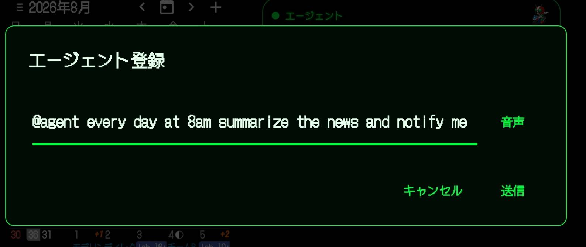
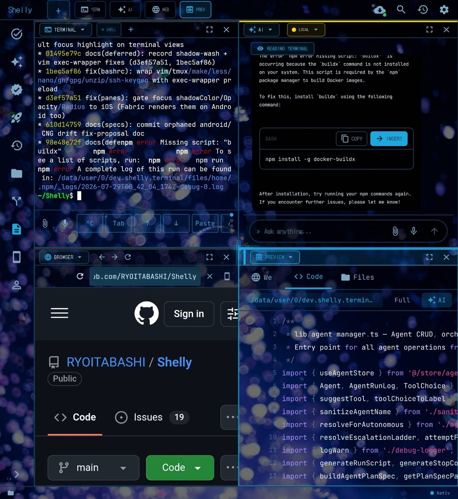
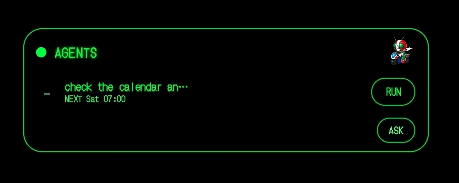
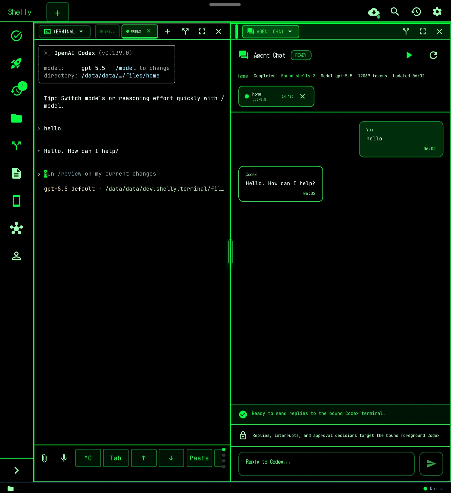
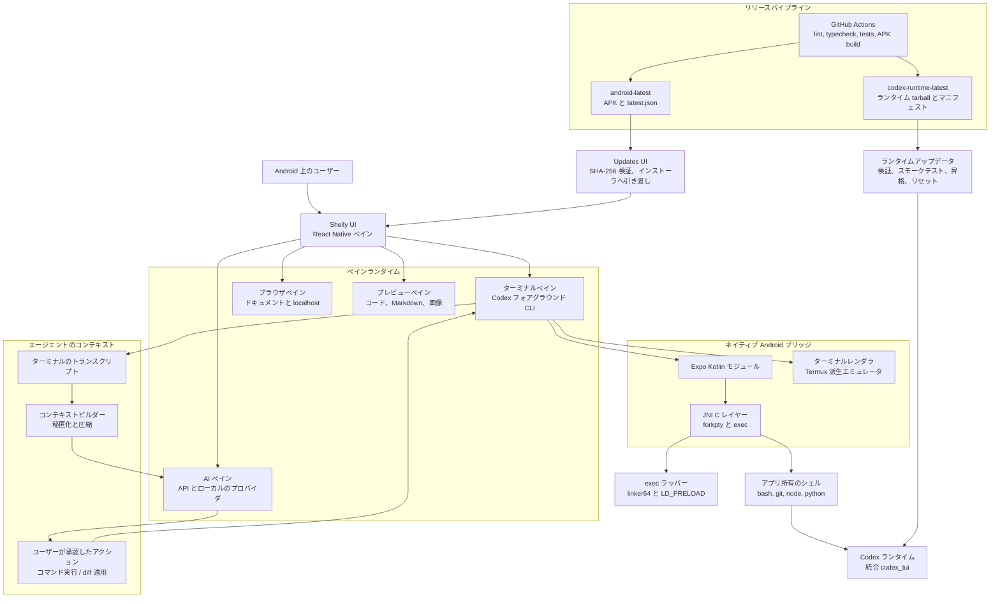
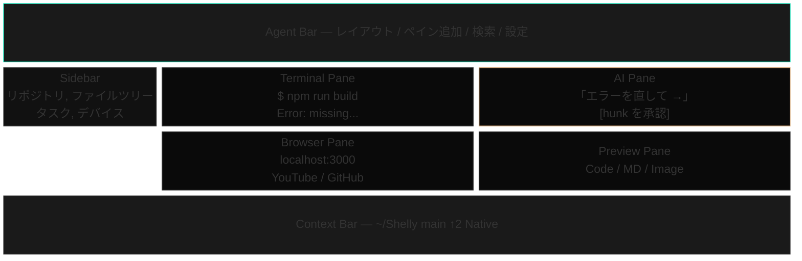
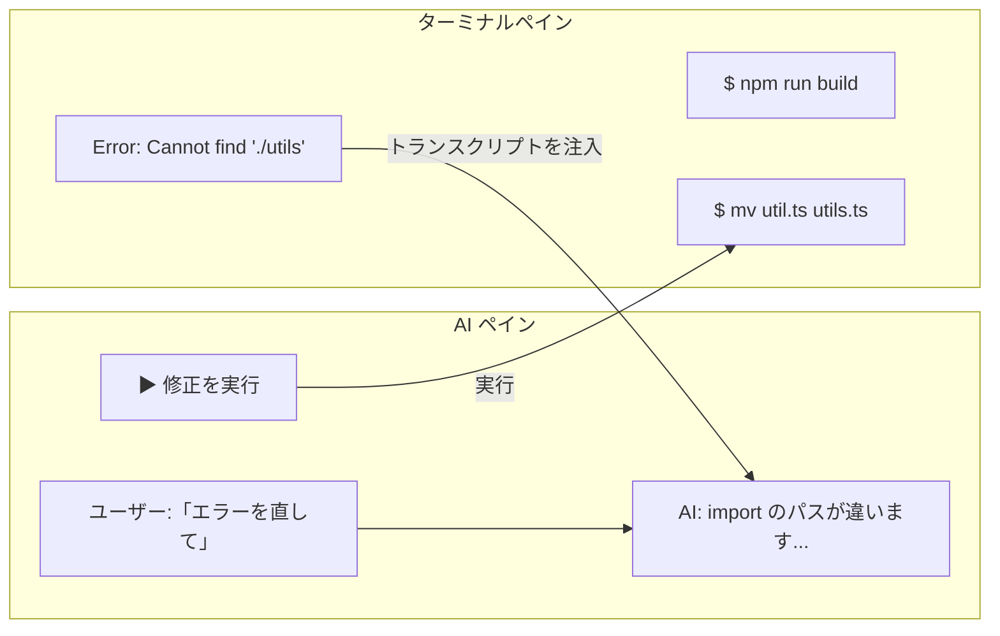
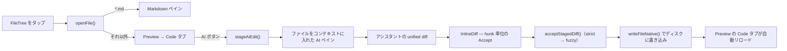
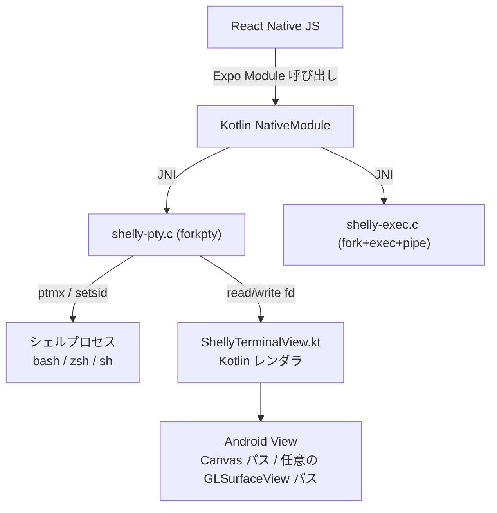
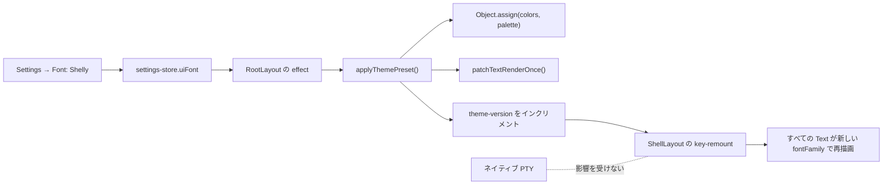

<p align="right"><a href="README.md">Read in English</a></p>

<p align="center">
  
</p>

<h1 align="center">Shelly</h1>

<h3 align="center">
  Android スマホを――折りたたんでいても、開いていても――そのまま自律エージェントマシンにする。<br>
  <sub>やってほしいことを普通の言葉で伝えるだけ。あとは自分のアラームで起きて、画面が消えたまま、あなた自身の AI アカウントとローカル LLM、そして本物のターミナルの上で仕事をします。クラウドランナー不要。PC 不要。Termux 不要。</sub>
</h3>

<p align="center">
  <sub><em>まず正直に書いておきます。無人での一連のサイクルが最後まで動くのを確認できたのは、<b>Galaxy Z Fold6 上で一度きり（N=1）</b>です。ここから先に何が検証済みで何がそうでないかは、<a href="#ステータス">ステータス</a>の表で追跡しています。</em></sub><br>
  <sub><b>エージェントを信用できる理由は、その下にあるもの:</b> ネイティブのターミナル IDE がまるごと入っています。アプリ自身が所有する JNI PTY 上で動く本物の Codex CLI、APK に同梱された bash / git / Python 3 / Node.js、そしてその隣に並ぶ API ベースの AI ペイン（Gemini・Cerebras・Groq・Perplexity・ローカルモデル）。エージェントがやることはすべて、あなた自身が開いて中身を見て、手で動かせるのと同じ端末上のシェルで走ります。Termux のインストールも、ディストロのブートストラップも、WebView ターミナルも、リモート IDE ブリッジもありません。</sub>
</p>

<p align="center">
  <a href="https://github.com/RYOITABASHI/Shelly/actions/workflows/build-android.yml"></a>
  
  
  
  
  
  <a href="https://buymeacoffee.com/ryo1221"></a>
</p>

<p align="center">
  
</p>

<p align="center">
  <a href="#動作デモ"><b>デモ</b></a> &nbsp;&middot;&nbsp;
  <a href="#クイックスタート"><b>クイックスタート</b></a> &nbsp;&middot;&nbsp;
  <a href="docs/MANUAL.ja.md"><b>マニュアル</b></a> &nbsp;&middot;&nbsp;
  <a href="#なぜshellyなのか"><b>なぜ Shelly か</b></a> &nbsp;&middot;&nbsp;
  <a href="#機能"><b>機能</b></a> &nbsp;&middot;&nbsp;
  <a href="#アーキテクチャ"><b>アーキテクチャ</b></a> &nbsp;&middot;&nbsp;
  <a href="#リリースの完全性"><b>リリースの完全性</b></a> &nbsp;&middot;&nbsp;
  <a href="#ステータス"><b>ステータス</b></a> &nbsp;&middot;&nbsp;
  <a href="#コントリビューション"><b>コントリビューション</b></a> &nbsp;&middot;&nbsp;
  <a href="#サポート"><b>サポート</b></a>
</p>


<br>

---

## 動作デモ

**自律エージェントを、ホーム画面のウィジェットから登録する ―― アプリを開く必要すらない**

https://github.com/user-attachments/assets/fbda309f-ad12-4a6d-a5b8-96b6ee4d4e57

Scouter ウィジェットの ASK ボックスに `@agent ...` と直接打つ（または話しかける）だけ。AI ペインに直接打ったときとまったく同じ確認フロー ―― 同じパース、同じ確認カード ―― に合流し、登録が終わるとスケジュール済みエージェント一覧に次回実行時刻付きで表示されます。

<br>

**その下にあるターミナル: 本物の AI コーディング CLI が Android 上でネイティブに動く**

https://github.com/user-attachments/assets/c87ea206-12f8-4b21-9089-0a373b0e8a2a

Termux なし。proot なし。リモート開発サーバーなし。OpenAI Codex ――本物のフル機能コーディング CLI ―― が、Shelly 自前の JNI PTY ―― 手で開いて操作できるのと同じネイティブターミナル ―― の上で直接起動します。

**開いた状態: サイドバー、ターミナル、AI、ブラウザ、プレビューが同時に生きている ―― 4 つの別々のアプリではなく、ひとつの同じセッション**

<p align="center">
  
</p>

---

## なぜShellyなのか

いま存在するものの多くは、この課題の一部分しかカバーしていません。ターミナルアプリ（Termux など）はシェルをくれますが、AI は載っていません。AI チャットアプリは賢いアシスタントをくれますが、その下にシェルはなく、ファイルにも触れません。クラウド開発環境（Replit など）は両方くれますが、それは手元の端末から遠く離れた「借り物のコンピュータ」の上の話です。クラウド「エージェント」も同じで、どこか別の場所で、自分のものではないファイルに対して動いています。

Shelly の賭けはこうです。ポケットの中のスマホは、あなたが所有している中で最良のエージェントホストである。常に電源が入っていて、常に一緒にいて、しかもあなたのファイル・アカウント・文脈をすでに抱えている。Shelly はそれを自己完結型のエージェントマシンに変え、さらにそのエージェントを本物のターミナル IDE に接地させます。だから、エージェントが勝手にやったことを、あなたは目で見て、検証して、手で動かし直せます。

**2 つのレイヤー、1 本の信頼の鎖:**

- **エージェント層** — やってほしいことを普通の言葉で言うと、Shelly はスケジュール済みエージェントとして登録します。AlarmManager のアラームで、画面が消えたまま起き、あなた自身のキーとローカルモデルで動き、実行したことを報告します。（[詳細](#自律エージェント) と、それに付随する[ステータス](#ステータス)の注意書き）
- **ターミナル層** — エージェントにできることはすべて、あなたが対話的に使っているのと同じ端末上のシェルとツールチェーンを通ります。アプリ所有のネイティブ PTY、本物の Codex CLI、同梱の bash / git / Python / Node。エージェントは「信じるしかないクラウドサンドボックス」ではなく、トランスクリプトのレベルまで覗ける、あなた自身のマシンです。

### コピペ問題

ターミナルで AI コーディングツール――Codex でも、ほかの AI CLI でも――を動かしているとします。エラーが出る。コピーする。ChatGPT に切り替える。貼り付ける。「何が悪いの？」と聞く。答えを読む。修正をコピーする。戻る。貼り付ける。実行する。

**7 ステップ。毎回です。**

CLI ベースの AI ツールを使っている開発者には見慣れたワークフローでしょう。ターミナルと AI は別々の世界に住んでいて、その間をつなぐコピペのブリッジは*あなた自身*です。

**Shelly はターミナルと AI を横に並べます。AI はターミナルの出力を自動で読みます。**

**「右側のエラーを直して」** と言えば、Shelly がターミナル出力を読み、エラーを説明し、実行可能なコマンドを生成します。**[Run]** をタップすれば、修正はそのままターミナルペインに着地します。

コピーなし。ペーストなし。タブの行き来なし。

**価値は 4 段階あります:**

- **単一ペイン:** Termux 単体より速く、賢く、使いやすいネイティブターミナル。インラインのコンテンツブロック、補完、シンタックスハイライト、タップできるエラー付き。
- **分割ペイン:** ターミナルと AI を横並びに。AI がターミナルの表示内容を読み、ワンタップで修正を実行します。コピペのブリッジは不要です。
- **フルレイアウト:** サイドバー + 最大 4 つのライブペイン + エージェントバー、つまりモバイル IDE。ブラウザペインでドキュメントを見て、右側でコードや Markdown をプレビューし、バックグラウンドで API ベースのエージェントを走らせつつ、ターミナルは常に中心に置いておけます。
- **無人運用:** 普通の言葉でスケジュール済みエージェントを登録すれば、スマホがポケットの中にある間も同じ仕組みが動き、実行結果を知らせてくれます。

**折りたたみ端末では、そのフルレイアウトは「理想」ではなく「初期状態」です。** 折りたたんでいるときの Shelly は単一ペインのターミナル。開けば、同じライブシェルがセッションを再起動することなく、サイドバー + 2×2 グリッドの最大 4 ペイン（ターミナル・AI・ブラウザ・プレビュー）に広がります。Shelly は Galaxy Z Fold6 上で毎日開発されているので、開いた状態のレイアウトは後付けではなく設計上のターゲットです。（CLI のストリーミング中に素早く折り曲げ ↔ 展開を繰り返すケースは、いまも[既知の制限](#既知の制限)に挙げてあります。）

---

## Android 固有の注意点

- **APK は約 800 MB あります。** シムではなく本物のツールを同梱しているからです。bash、
  Node.js、Python 3、git、curl、ripgrep、jq、tmux、vim、less、sqlite3、
  make、ssh――加えて OpenAI Codex CLI ランタイムまでが APK の中に入っています。
  Termux もリポジトリサーバーもパッケージマネージャのブートストラップもありません。
  初回起動時に、バイナリをアプリ専用領域へ展開します。
- **全ファイルアクセス権限**を初回起動で要求します。デスクトップのターミナルと同じ感覚で
  `/sdcard` を扱う（`cd /sdcard/Download`、そこのファイルを編集する、など）ために必要です。
  この権限がないと Scoped Storage が書き込みを黙って弾きます。拒否しても構いません――
  Shelly は自分のサンドボックス内では動きますが、`/sdcard` 以下のパスは `Permission denied` になります。
- **LD_PRELOAD + /system/bin/linker64** が、Linux レイアウトのバイナリを Android の bionic 上で
  動かす仕組みです（SELinux はアプリ専用領域の ELF に対する直接の execve を禁止しています）。
  ラッパーが `/bin/X` と `/usr/bin/X` を `/system/bin/X` に書き換え、アプリ同梱の ELF は
  `linker64` 経由に流します。ソースは
  `modules/terminal-emulator/android/src/main/jni/exec-wrapper.c` にあります。
- **設計として Termux 互換ではありません。** Shelly は Termux のパッケージも、Termux のパスも、
  Termux の prefix 前提も使いません。すでに Termux を入れていても、Shelly は自前のコピーを
  すべて同梱します。競合はしませんが、共有もしません。

---

## クイックスタート

### インストール

最新の Android APK は [**GitHub Releases**](https://github.com/RYOITABASHI/Shelly/releases) から入手できます。ローリング更新される `android-latest` リリースが最新ビルドの正となり、タグ付きの `vX.Y.Z` リリース APK も同じビルドから切り出されています。正確な `versionCode`・コミット・SHA-256 は [`android-latest/latest.json`](https://github.com/RYOITABASHI/Shelly/releases/download/android-latest/latest.json) で公開しています。

一度インストールすれば、あとはアプリ内から自己更新できます。上部バーのクラウドダウンロードボタン、または **Settings → Updates** を開いてください。Shelly は公開されている `android-latest/latest.json` マニフェストを読み、Android の `versionCode` を比較し、Android DownloadManager で `/sdcard/Download/shelly-update-<versionCode>/` に APK をキューイングし、SHA-256 を検証してから Android のパッケージインストーラを開きます。システム側のダウンロードは、Shelly をバックグラウンドに回しても再起動しても継続します。Play ストア外配布なので、インストールの確認は Android が改めて求めてきます。

リリース APK では Expo OTA を無効にしています。JS・ネイティブ・同梱ツールの変更は新しい APK としてまとめて配布され、インストール済みバイナリとアプリコードのズレが起きないようにしています。

### ソースからビルド

```bash
git clone https://github.com/RYOITABASHI/Shelly.git && cd Shelly
pnpm install && pnpm android
```

**必要なもの:**

- Android 端末
- Node.js 20 以上（CI は現在 Node 20 でビルドしています）
- pnpm
- Android NDK 26.1.10909125（またはこの固定 NDK を解決できる Android SDK / Gradle 環境）

Expo Go には対応していません。Shelly はネイティブの Kotlin / C モジュールを使っています。

Termux は不要です。bash、Node.js、Python 3、git、curl、ssh、sqlite3、tmux、vim、less、jq、make、ripgrep を同梱しています。同梱セット以外のツールが必要なら、Termux を Shelly と併用してください。

### 初回起動

初回起動時、Shelly は **全ファイルアクセス**を要求します。`/sdcard/Download` などスマホのどこにあるスクリプトでもターミナルから読めるようにするためです。**許可**をタップすれば準備完了、`source /sdcard/Download/foo.sh` がそのまま動きます。配布は当面 GitHub Releases のみで、Play ストア / F-Droid への申請はこれからの作業です。

### AI の設定

そのあと **Settings → API Keys** を開く（またはターミナルペインで `shelly config` を実行する）と、Gemini・Cerebras・Groq・Perplexity・OpenRouter・OpenAI 互換のローカルサーバーなど、明示的な API プロバイダのキーを貼り付けられます。キーは `expo-secure-store` に保存され、ログには一切書き出されません。

### サインイン

Shelly のフォアグラウンド AI CLI は **Codex** です。それ以外はすべて、キーを設定して使う API プロバイダです。

| 対象 | サインイン方法 | 補足 |
|---|---|---|
| **Codex CLI**（ChatGPT サブスクリプション） | `codex` を実行、または `codex-login --open` を直接実行 | 唯一サポートされているフォアグラウンド CLI です。`~/.codex/auth.json` が無い、または無効な場合、`codex` ラッパーが Shelly のデバイスコードログインを開始し、OpenAI のデバイスコードページをアプリ内ブラウザペインで開き、成功したら `~/.codex/auth.json` をパーミッション `0600` で書き込んでから、通常の Codex TUI を起動します。OpenAI API キーは不要で、ChatGPT サブスクリプションに乗ります。 |
| **API プロバイダ**（Gemini・Cerebras・Groq・Perplexity・OpenRouter・ローカル） | **Settings → API Keys** または `shelly config` | AI ペイン / `@mention` / `@team` / バックグラウンドエージェント用に、プロバイダごとにキーを貼り付けます（OpenRouter は有人時のみ）。キーは `expo-secure-store` に保存されます。ローカル / OpenAI 互換サーバーはベース URL だけで動きます。 |

> **Codex ログインについて。** REPL 内の `codex /login` は Shelly でのサポート対象パスではありません。素の `codex` を実行して Shelly のラッパーにデバイスコード認証を任せるか、bash から `codex-login --open` を実行してください。

### 同梱の Shelly コマンド

| コマンド | 用途 |
|---|---|
| `codex` | ネイティブターミナル内でフォアグラウンドの Codex TUI を起動。認証が無い場合は、先にデバイスコードログインを開始します。 |
| `codex-login --open` | ChatGPT サブスクリプションのデバイスコード認証を開始し、Shelly のブラウザペインで検証ページを開きます。 |
| `shelly-doctor` | シェル / ネイティブバイナリの有無、同梱 Codex バイナリ、JS ディスパッチャ、ローカル LLM エンドポイント、Codex 認証ファイルの有無をチェック。 |
| `shelly-codex-diagnose` | Codex のスモーク / カナリア / 編集 / パッチのより深い診断を実行。 |
| `shelly-update-clis codex --check-only` | 現在の Codex ランタイムをプローブ。ランタイムのインストールは通常 Updates UI から行います。 |
| `shelly-cs` / `cs` | GitHub Codespaces のヘルパーコマンド。 |

**まず試すなら:** プロバイダのキーを 1 つ設定したら、任意のペインで `@agent` に続けて普通の言葉の指示と時刻を書いてみてください。例: `@agent 月・火・水・木・金の朝8時に、最新の STEAM×AI 教育に関する論文とニュースを集めて、要約して Obsidian に保存して`（曜日は「平日」とまとめず区切って並べ、直後に時刻を続けるのがコツです）。Shelly はこれを端末上のスケジュール済みエージェントに変換します（[上のデモ](#動作デモ)がまさにこれです）。

---

## ランタイムモデル

エージェントの下にあるのが Shelly の構造的な強みです。ランタイムそのもの――あなたのファイルと同じ端末上のシェルで動くネイティブ PTY と、管理された Codex CLI。そしてその上に重なる API ベースのエージェント。WebView ターミナルでも、リモート IDE クライアントでもありません。

Termux や proot、あるいは別の Android ターミナル環境で AI コーディング CLI のワークフローが行き詰まったなら、Shelly は実機 Android の制約（bionic libc、`linker64` の exec ルール、`app_data_file` に対する SELinux）を前提に組んだ、メンテナンス済みの端末内環境を提供します。

壊れやすいターミナルスタックなし。WebView ターミナルのクラッシュなし。コピペ駆動のワークフローなし。

- **ネイティブ実行パス** — Codex はリモートブリッジやソケットターミナルではなく、Shelly がアプリとして所有するネイティブ PTY（JNI `forkpty`）上で動きます。
- **「最新」を盲信せず、管理する** — 各 APK には固定バージョンの Codex ランタイムが同梱されており、Updates UI からはローリングの `codex-runtime-latest` リリースにある検証済みの新しいランタイムを、次の APK を待たずにインストールできます。
- **状態が見える** — 直近のターミナルログをアプリ側で表示できるので、バージョンのズレや起動失敗を端末上でそのままデバッグできます。
- **コンプライアンス境界** — Codex はフォアグラウンドの、ユーザーが操作するターミナル CLI です。AI ペインやバックグラウンド自動化は明示的な API プロバイダを使い、隠れたサブスクリプションワーカーは動かしません。

ここが Shelly を「ターミナルの皮」以上のものにしている部分です。動きの速い CLI を Android 上で配布しつつ、更新作業をユーザーに押し付けずに済んでいる理由でもあります。

### リリースサーフェス

| 対象 | 状態 | 意味 |
|---|---|---|
| **Codex CLI** | サポート対象 | フォアグラウンド CLI。素の `codex` は、Shelly がアプリ内デバイスコード認証で `~/.codex/auth.json` を検証・作成したあと、ネイティブ PTY 上で通常の Codex TUI を起動します。 |
| **AI ペイン / バックグラウンドエージェント** | API 経由でサポート | 設定済みプロバイダ（Gemini API・Cerebras・Groq・Perplexity・OpenRouter〈有人の AI ペイン利用のみ〉・ローカルの OpenAI 互換サーバー）を使います。プロバイダキーベースで、サブスクリプションの隠れた再利用はありません。 |
| **Gemini API** | 設定済みなら利用可 | Gemini API キーを設定すると、AI ペイン、`@gemini` ルーティング、`@team`、マルチモーダル / API ベースのタスク、バックグラウンドエージェントで使えます。（これは API プロバイダとしての話で、Gemini CLI は同梱していません。） |

---

## Shelly ではないもの

Shelly は Termux の皮でも、WebView ターミナルでも、リモート IDE クライアントでもありません。Android のターミナルスタックをアプリ内で自前で持ち、あなたのファイルと同じシェルで Codex を端末上に動かし、そのターミナルの隣に API ベースのエージェントを並べます。コピペやクラウドワークスペースを経由させることはしません。

クラウドエージェントサービスでもありません。スケジュール済みエージェントは端末上で、あなたのキーで動きます。サーバー側のコンポーネントもサブスクリプションのランナーもありません。スマホの電源が切れていれば何も動かないし、そのことを取り繕いもしません。実行漏れは隠さず表に出します。

Termux のインストールなし。proot なし。ttyd なし。リモートブリッジなし。クラウドランナーなし。

---

## 機能

> 以下は現行ビルドで実装済みのパスについての記述です。実機での検証が限定的な項目（無人でのエージェント発火、TTS 再生、メーカー横断での信頼性など）は、この節と[ステータス](#ステータス) / [今後の予定](#今後の予定)の両方に注意書きを付けています。

### ハイライト

| | |
|---|---|
| **端末上で動く自律エージェント** | 普通の言葉で言えば、スケジュール済みエージェントがスマホの上で*自分だけで*（画面が消えた状態で）動き、あなた自身のキーとツールを使い、実行したことを知らせます。クラウドエージェントが届かない場所――あなたのファイル、ターミナル、ローカル LLM、端末そのもの――で動くのが強みです。*現時点では N=1 の検証です。[ステータス](#ステータス)を参照してください。* （[詳細](#自律エージェント)） |
| **マルチプラットフォーム配信** | エージェントの成果物は通知や Obsidian の下書きに限りません。Bluesky・Discord・Slack・Telegram・Mastodon・Misskey・WordPress に直接投稿したり、Webhook を叩いたりできます。プラットフォームごとのキーを一度保存すれば、あとは普通の言葉でエージェントに向き先を指示するだけ。*Bluesky はライブで端から端まで検証済みです。* |
| **ペインをまたぐ知能** | 「エラーを直して」と言うだけ。AI がターミナルを読み、修正を提案し、ワンタップで実行。コピペはゼロです。 |
| **AI Edit のゴールデンパス** | サイドバーでファイルをタップ → プレビュー → `[✨ AI]` → 変更内容を説明 → hunk 単位で承認 → ディスク上のファイルが書き換わり、プレビューが自動でリロードされます。 |
| **端末上での Codex apply_patch** | Codex のファイル編集は、シェル頼みのフォールバックではなく、エージェントのネイティブ patch ツール経由で Android 上に着地します。 |
| **ネイティブ PTY（JNI forkpty）** | Kotlin + C、PTY の fd を直接扱い、TCP / ソケットのブリッジなし。WebView ターミナルではなく、組み込みのネイティブターミナルです。 |
| **バッテリー同梱** | bash、Node.js、Python 3、git、curl、ssh、sqlite3、tmux、vim、less、make、ripgrep、jq が APK の中に入っています。Termux は不要です。 |
| **7 種類のペイン** | Terminal、Agent Chat、AI、Browser（+ バックグラウンド再生）、Markdown、Preview、Ask。最大 4 つまで自由に分割できます。 |
| **マルチエージェント AI** | API ベースの Gemini・Cerebras・Groq・Perplexity・OpenRouter・ローカル LLM に加え、フォアグラウンドの Codex ターミナル CLI。自動ルーティング、または対応するものは `@mention` で指定できます。 |
| **ローカル LLM（端末上、llama.cpp）** | Qwen3.5 系モデルを同梱の llama.cpp / llama-server フローで端末上で動かします。日常使いのデフォルトは Qwen3.5-2B、軽量なフォールバックとして Qwen3 1.7B / Qwen3.5 0.8B、4B 以上は短時間の品質確認に限定しています。 |
| **Android 上の Codex** | 上流を盲信せずに Codex を「管理された最新」に保ちます。各 APK は固定ランタイムを同梱し、Updates UI は検証済みランタイムリリースへ昇格でき、Reset で同梱ランタイムに戻せます。Codex は Shelly 自前のデバイスコードログインラッパーとともに、ネイティブ PTY 上で動きます。proot も root も不要です。 |
| **Scouter ホームウィジェット** | 半透明の Android ウィジェットが、アプリを開かずに Codex の状態・モデル・常時表示のトークン / コンテキスト / リミットのセル・ローカル LLM の健全性・端末負荷・次のスケジュール済みエージェントを表示します。しかも操作可能で、**RUN** は登録済みエージェントを無人実行のゲートを通して起動し、**ASK** は新規エージェントの登録にも使えます——ウィジェットに直接 `@agent ...` と打つ（または話す）と、AI ペインに直接打ったときと同じ確認フローに合流します。**Allow / Deny**、選択肢のピルはフォアグラウンドの Codex PTY を制御します。 |
| **カラーテーマ** | Blue / Red / Purple のパレットは既存のプリセット ID の上で動くので、実行中に切り替えても設定のマイグレーションなしでシェルが生き残ります。 |
| **音声入力** | コマンドや AI プロンプトを話しかけられます。文字起こしは Groq Whisper が担当し、そのテキストを VoiceChain がキーボードと同じ入力ルーターに流します。 |

### 自律エージェント

やってほしいことを普通の言葉で言うと、Shelly はスケジュール済みエージェントとして登録します。エージェントは**端末上で、単独で**動きます――画面が消えていても。Android の **AlarmManager**（`setExactAndAllowWhileIdle`。Termux 上の cron と違い、Doze 下でも発火するよう設計されています）で起き、**あなた自身のキーとツール**で端末上で動き、**実行したことを知らせます**（通知 + エージェントごとの次回 / 前回実行の表示。想定された実行が記録されていなければ実行漏れの警告も出ます）。

売りは「クラウドエージェントより賢い」ことではありません。**クラウドエージェントが届かない場所で動く**ことです。あなたのファイル、あなたのターミナルとスクリプト、あなたのローカル LLM、そしてスマホそのもの。

これは決まりきった機能ではなく、**自分のツールに向けて使う能力**です。私自身の例を 1 つ挙げます:

```
@agent every weekday at 8am, collect the latest STEAM×AI education papers and news,
and write the primary-source links + a short summary to my Obsidian vault
```

このスケジュールで登録されたエージェントは、発火するとスマホを起こし、Perplexity で調査し、日付とソース付きのサマリを Obsidian に落とします。無人で、上のデモと同じ実行です。スケジュールもソースも出力先も、自分のものに置き換えてください。

スケジュール指定は繰り返しだけでなく、相対的な*開始時点*も理解します。「来週から毎朝ニュースをチェックして」と言えば、エージェントはいま登録されつつ、最初の発火は解決された日付まで保留され、うっかり明日動き出すことはありません。（登録 / 確認カードのパスは実機で確認済みです。）

そもそもリクエストが曖昧すぎて動きようがない場合――目的語もドメインもない「なんか手伝って」のような場合――Shelly は空のタスクでエージェントを登録したりせず、いつ動かすかを聞く*前に*、実際に何をしてほしいのかを尋ねます。

**正直な注意点:** 無人での発火は Android のバックグラウンド制限に依存し、これはメーカーによって差があります（Samsung / Xiaomi / Oppo / OnePlus のバッテリー凍結機能）。Shelly は上に挙げた Android の最優先アラームパスを使い、実行漏れも表に出しますが、あらゆる端末での発火を*保証*することはできません。バッテリー最適化の除外を許可したうえで、エージェントの実行ビューを確認してください。

### Scouter ウィジェット

<p align="center">
  
</p>

Scouter は Shelly のホーム画面ステータス層です。ランチャーや別のアプリを開いている間も、現在の
Codex セッション、ローカル LLM エンドポイント、トークン / コンテキストの流れ、レートリミットの
ウィンドウ、端末負荷を見えたままにします。読むだけではありません。フォアグラウンドの Codex
ターミナルを操作したり、古くなったバインドを再開したり、キューに入れたプロンプトのために新しい
Codex PTY をコールドスタートしたり、次の登録済みスケジュールエージェントを Shelly を開かずに
実行したりできます。

<details>
<summary><strong>表示される内容</strong></summary>

- **状態で色が変わるステータス** — ステータスドットとタイトルがバインド中の Codex の状態（idle / thinking / running tool / waiting / error）に追従し、現在の `DOING` 行を表示
- **モデル / コスト行** — 現在の Codex モデルと、トークン数が取れる場合はそこから算出した `$cost`
- **常時表示の使用量セル** — `CTX`、`TOK`、`LIMIT`、`5H`、`WK` は Codex が動いていなくても表示され続けます。ライブの Codex データが最優先で、無ければ直近のサニタイズ済みスナップショットか、プレースホルダのダッシュにフォールバックします
- **レートリミットの残量ゲージ** — ウィンドウ（`5H` / `WK`）ごとの 5 セルの残量バー。健全なうちは緑、最後の 1 セル（残り 25% 前後以下）まで落ちると赤になります
- **レートリミットのオーバーライド** — セッションがスロットルされると、行は `RATE LIMITED` とリセット情報の表示に切り替わります
- **リセット / セッションタイマー** — 自走するクロノメーターがレートリミットのリセットまでをカウントダウン、または実行中セッションをカウントアップします
- **プライバシー配慮のプロンプトプレビュー** — プレビュー領域に出せるのは、現在のウィジェットの ASK / 承認 / 選択 / エラー状態だけです。過去の JSONL のプロンプトや返信は出しません。Agent Chat のタブをすべて閉じると、ウィジェットが縮むのではなくプレビュー領域が空白になります
- **スケジュールエージェントの状態** — 次に登録されているエージェントと発火時刻、およびウィジェット起動による直近の実行中 / 成功 / エラー結果
- **ローカル LLM の行** — ローカルサーバーのエンドポイント、バックエンド、キューの深さ、ping
- **フッター** — CPU / RAM 負荷と最終更新時刻
- **Codex ペット** — 任意の PET ボタン / ペット画像が、同梱のデモペットかユーザーがインポートした Codex ペットを描画します。個人のペットを APK に同梱することはありません

</details>

<details>
<summary><strong>インタラクティブな操作</strong></summary>

- **ASK** — ASK ピルをタップしてプロンプトを入力すると、Shelly がバインド中のフォアグラウンド Codex ターミナルに書き込み（行をクリアして貼り付け、Enter）、ランチャーに戻します
- **ASK からの `@agent` 登録** — 普通のプロンプトの代わりに `@agent ...` を入力（または音声で発話）すると、Codex PTY に流れる代わりに、AI ペインに直接 `@agent` と打ったときと同じ `parseAgentCommand` / 確認カードのフローに合流します。オプトインの **Widget No-Confirm Register** 設定（デフォルト OFF）をオンにすると、ウィジェット発の `@agent` コマンドにかぎり確認カードを省略して即登録し、登録後に通知が届きます。AI ペインに直接打った場合はこの設定に関わらず常に確認します。
- **ASK の音声入力** — ASK ダイアログのマイクボタンは Android 標準の音声認識を使います。認識結果はレビュー用にテキスト欄へ入るだけで、自動送信はされません。
- **スケジュールエージェントの RUN** — 次に有効かつスケジュール済みのエージェントを、アプリを開かずフォアグラウンドサービス経由で直接起動します。タップ時にディスク上のメタデータを再検証し、STOP-ALL を尊重し、無人時のアクション承認は fail-closed のままです。設計上、無人実行はデフォルトで OAuth / ローカルツールのみを使います。クラウド API キー（Gemini、Perplexity ほか）を無人で使うことになるエージェントは、オプトインの **Autonomous Cloud** 設定（デフォルト OFF）でクラウド呼び出しが許可されていない限り、Codex にフォールバックします。
- **コールドスタート ASK** — 利用可能な Codex / Agent Chat セッションが無い場合、Shelly はウィジェットのプロンプトをキューに入れ、ターミナルを開き、PTY が生きるまで待ち、`codex` を起動し、Codex の入力面が出るのを待ってから、キューのプロンプトを届けます
- **承認ピル** — Codex が許可を待っているとき、**Allow** / **Deny** のピルが `y` / `n` を Codex PTY に直接書き込みます
- **選択ピル** — 番号付きの対話プロンプトに対して、最大 6 個のウィジェットピルが選んだ数字を PTY に書き込みます。各ピルは選択肢のラベルを持ち、Android 通知には先頭 3 つのアクションが出ます
- **ペットのサイクル** — PET は既定で非表示から始まります。PET をタップすると最初のペットが出て、ペット画像をタップするたびに切り替わり、最後まで行くとまた隠れます。承認 / 選択のアクション行はペット操作より優先されます
- **ペットのインポート** — Settings → Scouter → Import pet ZIP でユーザーのペットをアプリ専用ストレージにインストールします。Codex のペットを APK の外で管理している人のために、共有ストレージ上の `Codex/pets` や `shelly-personal-pets.zip` のサイドカーファイルも検出します
- **古いタップのガード** — Allow / Deny / 選択のタップは、その時点のターミナル画面を読み直し、同じ承認アンカーや番号付き選択肢がまだ画面にある場合だけ発火します。無ければ何もしません
- **バインドが切れているときの再開** — バインド中のターミナルが終了していた場合、ASK（および保留中の承認）はプロンプト / 判断をキューに入れ、Agent Chat を開いてセッションを再開してから、キューのアクションを流し込みます
- **操作の配送方法** — ASK / 承認 / 選択の操作は、プロセス内のターミナルセッションレジストリ経由でライブ PTY に書き込みます。RUN はスケジュール発火と同じ、フォアグラウンドサービスへの直接 PendingIntent を使います。どちらのパスも `am start` を経由しません

</details>

<details>
<summary><strong>レイアウトシステム</strong></summary>

- **単一画面レイアウト** — AgentBar（上）+ Sidebar（左、折りたたみ可）+ PaneContainer（中央）+ ContextBar（下）
- **7 種類のペイン** — Terminal（ネイティブ PTY）、Agent Chat（Codex セッションのコンパニオン）、AI（ストリーミング + コンテキスト注入）、Browser（WebView + ブックマーク + バックグラウンド再生）、Markdown（ビューア）、Preview（Code / Image / PDF / CSV / Markdown のレンダラ）、Ask（Shelly のヘルプ）
- **プリセットのスロットレイアウト** — single / 2 カラム / 3 ペイン / 4 ペインのプリセットで最大 4 つのライブペイン。アクセントグリーンのグリップをドラッグしてリサイズ、ダブルタップで 50/50 に戻ります
- **レイアウトプリセット** — Single Terminal / Terminal + AI / Terminal + Browser / 3-Way Triple。すべてコマンドパレットから呼べます
- **ペインタイプのピル** — ヘッダー左に `[TERMINAL ▾]` / `[AI ▾]` などが出ます。タップするとその場でペインタイプを変更できます
- **ターミナルペイン内の CLI タブストリップ** — 1 ペインに複数のシェルタブ。`[● SHELL][+]` で、最後の 1 つ以外は `×` で閉じられます
- **空ペインからの復帰** — 最後の 1 ペインは閉じられません。万一ツリーが空になっても、3 ボタンの CTA（Terminal / AI / Browser）で戻せます
- **ContextBar** — cwd、git ブランチ、接続状態を常時表示するフッター

</details>

<details>
<summary><strong>ペインをまたぐ知能</strong></summary>

- **「右側のエラーを直して」** — AI が現在のターミナルのトランスクリプトを読み、実行可能な修正で応答します
- **ActionBlock** — AI の応答内のコードブロックに `[▶ Run]` ボタンが付き、アクティブなターミナルペインにディスパッチされます
- **ペインを意識したターミナル選択** — 分割レイアウトでは、AI ペインは自分のすぐ左のターミナル、次にフォーカス中のターミナル、最後に最初のターミナル、の順で選びます
- **リアルタイムなターミナル把握** — AI ペインはディスパッチ時点のターミナルトランスクリプトをスナップショットするので、モデルはあなたがいま見たものと同じものを見ます
- **ターミナル安全なコンテキスト** — ANSI / OSC / 制御シーケンスと TUI の再描画ノイズは注入前に除去されます。ターミナル出力は指示ではなく、信頼できない証拠として扱われます
- **ローカル LLM 向けの圧縮** — `@local` では重要なヘッダー / ステータス / エラー行と直近の末尾を残すので、小さな端末上モデルでも有用なターミナル状態を見られます
- **エラーファイルの自動ステージ** — ターミナル出力がファイルパスに言及していると、Shelly はそのファイルをステージでき、AI の diff をそのまま承認できます
- **CLI Co-Pilot** — 出力の逐次翻訳、承認プロンプトの説明、セッションの要約
- **Approval Proxy** — ターミナルの `[Y/n]` プロンプトをチャット風の `Approve / Deny / Ask AI` ボタンに引き上げるので、意味の分からない「Y」を打つことがなくなります
- **Error Summary** — 検出されたエラーは `[Suggest Fix]` 付きの永続的なチャットバブルとして出ます
- **Auto-savepoint** — すべての編集が隠し git インデックスに自動コミットされ、ワンタップで任意の時点に戻れます
- **コミット前のシークレットスキャン** — API キー、秘密鍵、その他のシークレットは savepoint コミットに入る前にブロックされます

</details>

<details>
<summary><strong>Agent Chat — バインド中の Codex ターミナルのチャット面</strong></summary>

- **フォアグラウンド Codex の上でのチャット** — セッション JSONL と Scouter のスナップショットから解析した、バインド中の Codex セッションのタイムライン（ユーザーのプロンプト、Codex の返答、ツール実行、承認、エラー）をチャット風に映すペイン
- **返信コンポーザ** — 返信を書いて送ると、隠れた API ワーカーではなく、バインド中のフォアグラウンド Codex PTY に書き込まれます。Shelly のコンプライアンス境界と一貫した設計です
- **READY / LOCKED** — バインド中のターミナルが返信を受け付けられるかをピルで表示します。ロック中はコンポーザが理由を説明します（ターミナル終了、Codex がビジー、ターミナル側の選択待ち、まだバインドされていない）
- **Approve / Deny** — 承認リクエストは Allow / Deny ボタン付きのバブルとして出て、判断をバインド中の Codex ターミナルに送ります。操作できるのは最新の保留中の承認だけです
- **Interrupt** — 停止ボタンが、作業中のバインド Codex にターミナル割り込みを送ります
- **Resume** — 再生ボタンが、選択中のセッションのバインド Codex ターミナルを開き直す / フォーカスして、返信用にバインドし直します
- **セッションタブ** — 最近の Codex セッションがタブとして表示され（ワークスペース + モデルで重複排除）、それぞれにバインドドットが付きます。dismiss はディスク上の JSONL に触れずに Agent Chat から隠すだけです
- **セッションストリップ** — 選択中のセッションのプロジェクト、ステータス、バインド、モデル、トークン数、最終更新時刻

</details>

<details>
<summary><strong>AI Edit — Accept / Reject 付きのファイル編集</strong></summary>

- **ファイルのステージ** — FileTree でファイルをタップすると Preview ペインの Code タブで開きます。ツールバーの `[✨ AI]` ボタンで、そのファイルを AI ペインのコンテキストにステージします。
- **ディスパッチ** — 「最初の関数のコメントを日本語にして」（でも何でも）と書いて送ります。Shelly のシステムプロンプトが、モデルに unified diff で応答するよう求めます。
- **InlineDiff** — アシスタントの返答から unified diff ブロックを走査し、各 hunk を `+` / `-` / コンテキストの色分けと Accept / Reject ボタン付きで描画します。
- **hunk 単位の承認がディスクに書き込む** — 1 つの hunk を承認すると、単一 hunk の diff に再シリアライズしたうえで `acceptStagedDiff()` を呼び、ネイティブの `writeFileNative` ブリッジ経由でファイルを書き換え、Preview ペインが自動リロードします。
- **ファジーな再アンカー** — `@@ -N` の行番号が古くなっている場合（先行する hunk がすでにディスク上のファイルを編集しているため）、適用側は hunk の先頭コンテキストブロックを前方検索するので、後続の hunk も着地します。
- **Accept All** — 同じ書き戻しパスを使い、保留中のすべての hunk を一度に適用します。

</details>

<details>
<summary><strong>ターミナルの拡張</strong></summary>

- **Fig スタイルの補完** — トップレベルコマンドに加え、サブコマンドとフラグの補完をインラインのポップアップで表示
- **シンタックスハイライト** — ターミナル出力を内容の種類に応じて色分け
- **タップできるパスとエラー** — ファイルパスやスタックトレース行をタップして飛べます
- **インラインコンテンツブロック** — JSON、Markdown、画像、テーブルをターミナル出力の中にそのまま描画（Command Blocks）
- **CLI 通知** — 長時間かかるコマンドは、完了時にシステム通知を出します
- **Codex の通知チャンネル** — Scouter はカテゴリごとに Android 通知を出し、それぞれ別チャンネルなので重要度 / 音 / ミュートを Android の通知設定から個別に調整できます。承認・選択・エラーはヘッドアップ通知、レートリミットは既定の重要度、完了と長時間実行は静かに届きます。承認通知にはワンタップの **Allow / Deny** ボタンが付き、選択通知は先頭 3 つの番号付きアクションを出します（ウィジェット本体では最大 6 つの選択ピルを表示できます）。展開表示ではリクエストやメニューの全文が読め、解決済みのカードは重複排除とキャンセルが行われるので、積み上がったり残り続けたりしません
- **SmartKeyBar** — 文脈に合わせて切り替わる 5 つのキーセット（Default / Vim / Git / REPL / Navigate）。スワイプで切り替え
- **不死のセッション** — tmux がアプリのバックグラウンド中もシェルを生かし続け、任意のセッションを名前で再開できます
- **ターミナルでの日本語入力** — ターミナルペイン内で CJK 文字を直接変換入力できます
- **読めるターミナルのグリフ** — ネイティブ Kotlin のターミナルビューが PTY のグリッドを JetBrains Mono で描画するので、小文字・カラム・コード出力が判読できる状態を保ちます
- **アトミックなペースト** — すべてのペースト経路が `TerminalEmulator.paste()` に集約されます。ゲストシェルが bracketed-paste モード（DECSET 2004）を有効にしている場合はペイロードをラップするので、複数行のコマンドが 1 イベントとして届き、readline は末尾の改行だけを実行します。それを通知しないシェル / TUI（vim、less、nano）には、改行を正規化するフォールバックを使います。IME の複数行入力や 16 文字以上のコミット、マウス中クリックのペースト、CommandKeyBar の **Paste** キーは、すべて同じ正規化処理に到達します。

</details>

<details>
<summary><strong>AI ペイン</strong></summary>

- **マルチエージェントのルーティング** — ルーターがタスクに最適な AI を選びます。`@mention` で上書きできます
- **@mention** — AI ペインの直接プロバイダは `@gemini`、`@cerebras`、`@perplexity`、`@openrouter`、`@local`。ユーティリティ系のルートには `@team`、`@agent`、`@git`、`@open` / `@browse`、`@plan`、`@arena`、`@actions` / `@ci` があります。`@claude` はありません――Claude Code は現在のプロバイダではないためです。Codex は `codex` によるフォアグラウンドのターミナル CLI として利用できます。（Groq はプロバイダとして設定できますが、`@groq` のメンションパターンにはまだ結線されていません。）
- **ターミナルコンテキストの注入** — 何も貼り付けなくても、AI は常に現在のターミナルトランスクリプトにアクセスできます
- **hunk 単位で書き戻す InlineDiff** — 上記参照
- **音声入力** — ターミナルのアクションバーのマイクを長押しすると VoiceChat が開きます。音声 → Groq 文字起こし → AI → TTS 応答
- **ローカル LLM サポート** — 内蔵の GGUF カタログと llama.cpp / llama-server のコントロールを使い、`@local` でルーティングすれば完全に端末上での推論になります。デフォルトは Qwen3.5-2B Q4_K_M、より軽いフォールバックが Qwen3 1.7B と Qwen3.5 0.8B、4B / 9B は短時間の品質確認用という位置づけです。

</details>

<details>
<summary><strong>ブラウザペイン</strong></summary>

- **フル WebView** — ペイン内で任意の URL を開けます。ターミナルの隣にドキュメントを出しっぱなしにできます
- **ブックマーク** — URL の保存と整理。YouTube、X、GitHub、`localhost:*` にはプリセットアイコンが付きます
- **バックグラウンド再生** — ペインを切り替えても音声は鳴り続けます
- **リンクの取り込み** — Android の任意のアプリから Shelly に URL を共有すると、ブラウザペインで開きます
- **デスクトップ UA トグル** — URL 行の `📱` / `🖥` ボタンで User-Agent を切り替え、デスクトップ専用サイトも正しく動くようにします
- **動画の全画面** — 6 通りの検出パス（W3C / WebKit / video 要素 / モンキーパッチした API）で YouTube 的な全画面化を捕まえ、ペインを最大化してシステムナビゲーションバーを隠します

</details>

<details>
<summary><strong>ファイルツリー</strong></summary>

- **アクティブリポジトリのファイル一覧** — カレントディレクトリの `ls -1pa` 相当の一覧。拡張子ごとにアイコンを色分け（`.tsx` は空色、`.ts` は青、`.json` は琥珀、`README.md` は赤、など）
- **検索** — カレントディレクトリに対するインクリメンタルフィルタ
- **開くときの挙動** — Markdown ファイルをタップすると Markdown ペイン、それ以外は Preview ペインの Code タブで開きます
- **作成 / リネーム / 削除** — 検索欄の横にある `+` ファイル / `+` フォルダボタン。行を長押しすると `Rename / Copy path / Delete`。モーダルはアクティブなアプリのパレットを使います
- **パンくず** — `..` の行をタップで 1 階層上へ

</details>

<details>
<summary><strong>プレビューペイン</strong></summary>

- **Code タブ** — ファイルごとのシンタックスハイライト表示と行番号。`[✨ AI]` ボタンで現在のファイルを AI Edit 用にステージします
- **Markdown レンダラ** — `react-native-markdown-display` に Shelly のパレットを適用
- **画像 / PDF / CSV レンダラ** — よくある非コード添付のためのインラインビューア
- **Git diff ビュー** — `git diff <file>` を Code タブでネオンの `+` / `-` 配色で表示
- **最近のファイル** — Preview のヘッダー内クイックスイッチャ

</details>

<details>
<summary><strong>サイドバー</strong></summary>

- **リポジトリ** — バインド済みリポジトリのパス一覧。タップで切り替え、ファイルツリーのルートもそのリポジトリに変わります
- **ファイルツリー** — 上記参照。セクションとして埋め込まれているので、サイドバーの高さに合わせて伸縮します
- **タスク** — 直近のバックグラウンドエージェント実行と、その所要時間・ステータス
- **デバイス** — クイックアクセス用フォルダ（`~`、`/sdcard/Download` など）。ワンタップでファイルツリーを付け替えます
- **プロファイル** — 保存済みの SSH 接続。タップするとアクティブなターミナルペインに `ssh -i KEY user@host -p PORT` を挿入します。長押しで編集 / 削除、`Import from ~/.ssh/config` でホストを一括追加。鍵ファイル認証のみで、パスワードやパスフレーズは保存しません。

> **クラウドストレージは？** Shelly はあえて Google Drive / Dropbox / OneDrive の UI を載せていません。ターミナルアプリなら、すでにこの問題を解いているツールに乗るべきです。Shelly 自身はパッケージマネージャを持ちませんが、[`rclone`](https://rclone.org) は単一の静的バイナリとして配布されています。`arm64` のリリースをダウンロードし、`PATH` の通ったディレクトリに置き（あるいは Termux を併用してインストールし）、`rclone config` を一度実行すれば、40 以上のクラウドバックエンドをターミナルペインからマウント / 同期できます。

</details>

<details>
<summary><strong>コマンドパレット</strong></summary>

上部バーの検索アイコン（または AgentBar の git バッジ）から開きます。登録済みのすべてのアクションをあいまい検索でき、直近 5 件の **Recent** リストも常に表示されます。

現在登録されているもの:

- **Settings** — ターミナル風の設定 TUI を開く
- **Terminal** — Clear / New session / Restore tmux / Tmux attach
- **Git** — Status / Diff / Log / Add all / Commit / Push / Pull --rebase *（アクティブなターミナルペインの `pendingCommand` チャンネル経由）*
- **Panes** — Terminal / AI / Browser / Markdown / Preview の追加
- **Layouts** — Single Terminal / Terminal + AI / Terminal + Browser / 3-Way Triple
- **Theme presets** — Blue / Red / Purple
- **Font presets** — Silk / 8bit / Mono とレガシーのエディタパレット
- **Voice** — 対話を開く（VoiceChat モーダル）
- **Snippets** — スニペットストアの先頭 20 件。それぞれターミナルにディスパッチされます
- **Package Manager** — 同梱ツールの状態

</details>

<details>
<summary><strong>テーマとフォント</strong></summary>

- **カラープリセット** — Blue がデフォルトのクールなパレット、Red は赤〜オレンジ系のクローム、Purple は紫にネオングリーンのアクセント。
- **表に出ているプリセット** — 設定とコマンドパレットに出すのは 3 つのカラーテーマです。レガシーやエディタ系のパレット ID は古い保存設定のために受け付け続けますが、UI の主役ではありません。
- **実行中の切り替え** — プリセットの切り替えは、ライブの `colors` オブジェクトを（同一性を保ったまま）その場で書き換え、シェルレイアウトを key-remount させる theme-version ストアを進めることで行います。PTY セッションは切り替えを生き延びます――開いている vim はそのままです。
- **単一ファミリでの描画** — すべての Text は `fontWeight` に関係なく JetBrains Mono を通るので、UI とターミナルのタイポグラフィが揃います。
- **Text.render のモンキーパッチ** — 子が独自の `style` を渡した場合、`Text.defaultProps.style` はマージではなく置換されます。そのままだと 100 箇所以上の呼び出し元がテーマフォントから外れてしまいます。パッチはすべての Text の style 配列の先頭に `{ fontFamily }` を挿し込むので、呼び出し元を触らずにプリセットのフォントが行き渡ります。
- **ネオングロー** — 色ごとに 8 種類の `textShadow` スタイル（teal / blue / sky / purple / pink / green / red / amber）で、モックの「読めるターミナル」感を再現
- **ハプティクスのトグル** — 操作ごとのフィードバックの ON / OFF

</details>

<details>
<summary><strong>Git 連携</strong></summary>

- **コマンドパレット** — 上に挙げた 7 つの git アクション
- **Auto-savepoint** — git ベースのバックグラウンド保存システム（`lib/auto-savepoint.ts`）。コミット前に毎回シークレットのパターンスキャンを行います
- **Git diff プレビュー** — Preview ペインの Code タブが `git diff <file>` をネオンの diff パレットで描画

</details>

<details>
<summary><strong>設定・API キー・バックグラウンドエージェント</strong></summary>

- **インライン API キーエディタ** — Gemini / Cerebras / Groq / Perplexity / OpenRouter とローカル / OpenAI 互換の API キーを、設定のドロップダウン内でマスク表示と行ごとの `EDIT / CLEAR / SAVE / CANCEL` で編集できます。キーは `expo-secure-store` に保存されます。
- **設定 TUI** — 全設定はターミナル風のテキスト UI からも触れます
- **コマンドの安全性** — 正規表現ベースの 5 段階リスク評価（ファイアウォールではなくシートベルトです。[セキュリティ](#セキュリティ)を参照）
- **ワークスペース分離** — プロジェクトごとの cwd / env / AI コンテキスト
- **バックグラウンドエージェント** — `@agent list`、`@agent status`、`@agent run <name>`、`@agent stop <name>`、`@agent history <name>`、または `@agent <自然言語>` で新規作成。スケジュール済みエージェントは設定に応じて AlarmManager 経由で動きます。
- **管理された Codex ランタイム更新** — Updates UI が公開の `codex-runtime-latest/codex-runtime.json` マニフェストを読み、tarball をダウンロードし、SHA-256 を検証し、`codex_tui --version` と `codex_tui exec --help` でスモークテストしてから、`~/.shelly-runtime/codex/current` 以下にランタイムを昇格させます。新しいランタイムは新たに開いたターミナルタブから使われ、**Reset** で APK 同梱ランタイムに戻せます。
- **`shelly-doctor`** — シェル / ネイティブバイナリの有無、同梱 Codex バイナリ、JS ディスパッチャ、ローカル LLM エンドポイント、`~/.codex/auth.json` の有無をチェックする診断コマンド。何かおかしいと感じたら実行してください

</details>

### Codex ランタイム

<p align="center">
  
</p>

- **ネイティブランタイム** — npm の `@openai/codex` パッケージは JS ディスパッチャ側の話の一部にすぎません。リリース APK には `.ci-versions/` の固定された Android ネイティブの統合 `codex_tui` バイナリが同梱され、ランタイム更新も同じ形のものを `~/.shelly-runtime/codex/current` にインストールします。
- **管理された昇格** — 新しいランタイム候補は、ダウンロード・SHA-256 検証・展開・実行可能性チェック・`codex_tui --version` / `codex_tui exec --help` のスモークチェックをすべて通ってから初めて昇格します。
- **修復 / リセットのパス** — アプリデータ側のランタイムが壊れている、あるいは不要な場合は、Updates UI から最新のランタイムリリースで修復するか、APK 同梱の Codex ランタイムにリセットできます。

---

## ステータス

| 領域 | 状態 |
|---|---|
| ネイティブ PTY、セッション、tmux 復活 | ✅ 出荷済み |
| マルチペインレイアウト（7 種類、分割、プリセット、ドラッグリサイズ、空状態の CTA） | ✅ 出荷済み |
| アトミックペースト（ゲストが DECSET 2004 で申告したときの bracketed-paste ラップ、`TerminalEmulator.paste()` 単一チョークポイント、IME のチャンク分割の統合） | ✅ 出荷済み（bug #91、#94、#97、#106） |
| `MANAGE_EXTERNAL_STORAGE` による `/sdcard` アクセス（初回起動時の許可フロー） | ✅ 出荷済み（bug #92） |
| shebang と `bash script.sh` のための `$HOME/bin/bash` の bash ラッパー | ✅ 出荷済み（bug #93） |
| `execSubprocess` の JNI 読み取りループ（EAGAIN と EOF の区別） | ✅ 出荷済み（bug #70） |
| AI Edit のゴールデンパス（ステージ → diff → hunk 単位の承認 → ディスク書き戻し） | ✅ 出荷済み。後続 hunk のためのファジー再アンカー付き |
| FileTree の CRUD（作成 / リネーム / 削除 / パスのコピー） | ✅ 出荷済み |
| コマンドパレット — settings、terminal、git、panes、layouts、theme、font、voice | ✅ 出荷済み |
| ブラウザの全画面、デスクトップ UA トグル、リンク取り込み、ブックマーク | ✅ 出荷済み |
| テーマプリセット — Blue / Red / Purple（保存済み設定のためにレガシープリセット ID も受け付け。実行中の切り替え、Text のモンキーパッチ） | ✅ 出荷済み |
| サイドバーの Add Repository の存在チェックとゴーストパス時の Alert | ✅ 出荷済み（bug #73） |
| AI ペインのローカル LLM ルーティング（URL 駆動、有効化トグル不要） | ✅ 出荷済み（bug #68） |
| 音声対話（VoiceChat + VoiceChain + TTS） | ✅ 音声入力（マイク → 文字起こし → ルーティングされた応答）は 2026-07-27 に実機で確認済み。専用のフルスクリーン VoiceChat モードと TTS 再生については、今回のパスでは独立に再検証していません |
| 不死のセッション（tmux キープアライブ） | ✅ 2026-07-27 に実機で確認済み — `vim` セッションの対話状態（挿入モード、未保存のバッファ、カーソル位置）が、バックグラウンド / フォアグラウンドの往復を無傷で生き延びました。単なるトランスクリプトの再生ではありません |
| llama.cpp による `@local` のローカル LLM（Settings · Integrations · Local LLM: カタログ、ダウンロード、開始 / 停止） | ✅ 出荷済み |
| MCP サーバー（Settings · Integrations · MCP Servers） | ✅ 出荷済み |
| Codex CLI の起動 / 認証 | ✅ サポート済み。素の `codex` は、TUI 起動前に Shelly のデバイスコード認証を通してネイティブ PTY 上で動きます |
| 管理された Codex ネイティブランタイム（`codex_tui` を `~/.shelly-runtime/codex/current` にステージ、`--version` と `exec --help` でスモークテスト、同梱ランタイムへの修復 / リセット） | ✅ 管理された最新 |
| AI ペイン / `@gemini` / `@team` / バックグラウンドエージェントでの Gemini API | ✅ Gemini API キーを設定していれば利用可 |
| AI ペイン / `@openrouter` での OpenRouter（有人時のみ ―― 無人実行が OpenRouter を経由することはありません） | ✅ OpenRouter API キーを設定していれば利用可。実機ではライブのエンドポイントに到達するところまで確認済み（Settings の入力欄、メンションのルーティング、実際の HTTP 認証エラーが表示されること）―― 本物のキーでストリーミング応答を最後まで受け取るところまでは、まだ試せていません |
| バックグラウンド / 自律エージェント — `@agent` での登録、AlarmManager による無人実行（getForegroundService）、実行 / 次回 / 前回 / 実行漏れの可視化 | ✅ 結線済み。無人での発火を Z Fold6 上で端から端まで 1 回観測（N=1、発火時点でアプリはキャッシュ済み）。メーカー横断の信頼性は、まだ広くはテストできていません |
| エージェントの SNS 投稿コネクタ — Bluesky、Discord、Slack、Telegram、Mastodon、Misskey、WordPress | ✅ Bluesky はライブで端から端まで検証済み。残り 6 つは同じコードパスとテストカバレッジに乗っていますが、それぞれ実アカウントに対して発火させたわけではありません |
| エージェントのタスク明確性検出 — リクエストが曖昧すぎるとき、スケジュールを聞く前に「実際に何をするのか」を尋ねる | ✅ 出荷済み。2026-07-27 に実機で確認済み |
| Scouter ウィジェットの RUN（ウィジェット起動のエージェント開始） | ✅ 出荷済み。スケジュールアラームの発火と同じ無人実行ゲートを通ります。クラウド API ベースのエージェントは、オプトインの **Autonomous Cloud** 設定（デフォルト OFF）がクラウド呼び出しを許可しない限り Codex にフォールバックします。これはバグではなく、意図どおりに動いている資格情報ポリシーです |
| Scouter ウィジェットの `@agent` 登録（ASK からの新規エージェント登録、音声入力、オプトインの確認省略登録） | ✅ 出荷済み。2026-07-30 に実機で確認済み — ASK は `@agent` テキストを、直接入力したときと同じ AI ペインの確認フローへ流します。**Widget No-Confirm Register** が OFF なら通常どおり確認し、ON なら即登録して通知が届きます。音声入力はテキスト欄に入るだけで自動送信はされません |
| サイドバーの SSH プロファイル（鍵ファイル認証、~/.ssh/config のインポート、タップで接続） | ✅ 出荷済み |
| サイドバーの Quick Launch / Worktrees（ワンタップの CLI ショートカット） | ✅ Codex について出荷済み |
| アプリ内の Android APK 更新（`android-latest/latest.json`、SHA-256 検証、Package Installer への引き渡し） | ✅ 出荷済み |
| アプリ内の Codex ランタイム更新（`codex-runtime-latest/codex-runtime.json`、スモークテスト済みのランタイム昇格 / リセット） | ✅ 出荷済み |
| クラウドストレージ | 🚫 スコープ外 — ターミナルペインから `rclone` を使ってください |
| アプリアイコン | ✅ 出荷済み |
| 配布チャンネル（Play ストア / F-Droid） | 🟡 当面は GitHub Releases のみ。現行の Android リリースはローリングの `android-latest` ビルドです |

検証チェックリストの全体: [`docs/superpowers/specs/2026-04-13-validation-checklist.md`](docs/superpowers/specs/2026-04-13-validation-checklist.md)

---

## 今後の予定

アプリの一部は書かれてはいるものの、まだ検証できていません。以下は短期のロードマップであって、現行ビルドに入っているものではありません:

- **Play ストア / F-Droid での配布** — APK の公開は GitHub Releases 経由のみで、ストアへの申請フローはまだ済んでいません
- **メーカー横断での自律エージェントの信頼性** — 無人でのスケジュール発火は Z Fold6 で観測済み（N=1）ですが、Android のバックグラウンド制限はメーカーによって異なります（Samsung / Xiaomi / Oppo / OnePlus のバッテリー凍結機能）。幅広い端末での信頼性検証と、端末の健全性 / 権限チェックリストはまだできていません
- **スニペット作成 UI** — コマンドパレットはスニペットストアの先頭 20 件を表示してターミナルにディスパッチしますが、アプリ内での作成 / インポート / 編集のフローは以前の整理で削除されました。スニペットは `~/.shelly/snippets.json` を直接編集するか、`shelly config` から追加できます。

---

## ストーリー

### コードは自分の手では書いていません。

私は Creative Director であって、訓練を受けたエンジニアではありません。このリポジトリの全行は、私のディレクションのもと AI が生成したものです。Samsung Galaxy Z Fold6 の上で AI コーディングエージェントと会話しながら――デスクトップもラップトップも使わずに――書かせ、レビューし、実機でテストして出荷しています。アーキテクチャ上の判断はすべて私のものです。キーストロークは違います。私が持ち込んでいるのは、「画面に何を置き、何を置かないか」についての 20 年分のプロダクト判断で、結局のところそれが仕事の大半でした。

これは成り立ちの話であって、意図的に**信頼の話ではありません**。「AI が書いた」というのは、コードを *より高い* 検証基準にさらす理由であって、下げる理由ではありません。あなたはこのアプリにシェルの実行権限と広いストレージアクセスと API キーを渡すかどうかを判断しているわけですから、「なぜ信頼できるのか」への誠実な答えは、コードのまわりにある規律です。そのすべてがこのリポジトリで監査できます:

- **「完了」の前に実機で検証する。** 実機で動くのを観測するまで機能を出荷済みにはしませんし、観測が 1 回きりならそう明記します。この README の[ステータス](#ステータス)表にある N=1 の注記は、そのポリシーを公開しているものです。
- **本物のコードを実行するテスト。** エージェントパイプラインのリグレッションテストは、実際に生成されるスクリプトを本物のプロセスで走らせます――本物の bash 実行、本物の HTTP 失敗面。出荷されるものから静かに乖離しうる手書きの再実装ではありません。
- **リスクの高いマージの前に敵対的レビュー。** ネイティブ、OAuth、IPC、セキュリティ境界に関わる変更は、着地前に別エージェントによるレビューを明示的に一段挟みます。署名付き承認チャンネルと自律エージェントの実行ゲートは、専用のセキュリティレビューを通しました。
- **雰囲気ではなくエンジニアリング台帳。** [`docs/superpowers/DEFERRED.md`](docs/superpowers/DEFERRED.md) が、何が出荷済みで、何がフラグで OFF にされていて、何が壊れていると分かっているのかについての唯一の真実の情報源です。理由と優先度付きで書いてあります。この README が言葉を濁しているときは、その濁りの出どころはここです。
- **エージェントスタックは、大きな音を立てて閉じる方向に倒れるよう作ってあります。** 無人実行はローカルとクラウドのバックエンドをまたぐエスカレーションラダー（`lib/agent-escalation-ladder.ts`）を登り、品質ゲートは「やった」と宣言するだけで実際には作業していない完了を弾き、承認が必要な無人アクションは未レビューのまま走るのではなく fail-closed で止まります。

スクリーンショットに写っているキーボード？ あれも私が作りました。[Nacre](https://github.com/RYOITABASHI/Nacre) といって、Kotlin で書いた Android の IME です。これも全部 AI との会話だけで作りました。いままさに Shelly の中でそれを使って打ちながら、両方のアプリを同時に改善しています。

これはポートフォリオ用のプロジェクトではありません。私が毎日ものづくりに使っている道具です。もっと良くできるところを見つけたら、そのための issue トラッカーです。

### そもそも、なぜこれが存在するのか

モバイル開発は結局のところ普及しませんでした。スマホの計算能力が足りなかったからではなく、**入力**と**インターフェース**が「作ること」向けに設計されていなかったからです。

チャットアプリ（ChatGPT、Claude、Gemini）はコードについて*話す*ことはできても、*実行*できません。ターミナルエミュレータ（Termux）は何でも*実行*できますが、すでに開発者である人以外には冷たすぎます。

Shelly はその隙間を埋めます。AI ペインに「ポートフォリオサイトを作って」と打てば、本物のシェルがコマンドを実行し、ファイルを生成し、その結果を――それを生み出したターミナルのすぐ隣に――見せてくれます。

そして、その仕組みができてしまえば次の一歩は明らかです。見ていなくても動くようにすればいい。繰り返しのタスクを一度説明しておけば、スマホが自分のアラームで実行します。つけっぱなしのノート PC も、クラウドランナーのサブスクリプションも要りません。

### すべての設計判断が「問い」の形をしている理由

Shelly のあらゆる機能は、既存ツールへの私の不満から始まっています:

- ペイン間の仕組みは *「なんで片方のウィンドウからエラーをコピーして、もう片方に貼らなきゃいけないんだ？」*
- ネイティブターミナルは *「なんでアプリを切り替えるたびにターミナルが死ぬんだ？」*
- Approval Proxy は *「AI CLI が英語で承認を求めてくる。意味が分からない。」*
- VoiceChain は *「スマホのキーボードでは、思いつく速度に打鍵が追いつかない。」*
- レイアウトシステムは *「なんでブラウザとターミナルと AI を同じ画面に同時に置けないんだ？」*
- カラーテーマのプリセットは *「なんで使いやすい UI と、見ていて面白い UI のどちらかを選ばされるんだ？」*

制約はすべて、エンジニアにとっても同じくらい必要な工夫に変わりました。

### なぜネイティブなのか — WebView からの転回

初期バージョンは ttyd と WebView を使っていました。WebSocket 接続は切れる。Android の Phantom Process Killer がバックグラウンドプロセスを殺す。アプリを切り替えるたびにターミナルは死んでいました。

そこで私は AI に、全部捨ててネイティブに行けと指示しました。いまの Shelly はネイティブのターミナルエミュレータを内蔵しています――Termux 自身の `terminal-emulator` ライブラリから派生した Kotlin コードを、JNI の C レイヤー経由でアプリ所有の PTY につないだものです。TCP のターミナルサーバーなし。WebSocket の境界なし。落ちる ttyd プロセスもなし。

React Native アプリとしては珍しいアーキテクチャです。WebView でも外部ターミナルサーバーへのソケットブリッジでもなく、JNI `forkpty` によるアプリ所有の PTY を背後に持つ、組み込みのネイティブターミナルエミュレータなのですから。

### 誰のためのものか

- **自分のハードウェアの上でエージェントを動かしたい人** — 自分のアラーム、自分のキー、自分のファイルの上で動くスケジュール済みの無人タスク。シェルのトランスクリプトのレベルまで監査できます
- **Vibe Coder** — Lovable / Bolt / Replit Agent のようなものを、本物のターミナルを下に敷いた状態でスマホの上に
- **モバイルファーストの開発者** — Codex CLI ユーザーや、CLI ファーストの AI コーディングワークフローを本気でやりたい人で、本物のローカルターミナルを囲むちゃんとしたマルチペイン IDE が欲しい人
- **アイデアを持つ非エンジニア** — Shelly がすべてを翻訳します。危険な操作は実行前に説明と承認ステップとともに提示されます

---

## アーキテクチャ

### システム構成



Shelly の核は、普段は別々になっている 3 つのシステム――Android ネイティブのターミナルランタイム、
フォアグラウンドの Codex CLI、コンテキストを理解する AI ペイン――のつながりにあります。
ターミナルは WebView でもリモートブリッジでもなく、Kotlin が JNI 経由で読むアプリ所有の PTY です。
更新の仕組みも 2 系統に分かれていて、APK リリースがアプリとネイティブのペイロードを更新する一方、
Codex ランタイムのレーンは SHA-256 検証とスモークテストを経てより速く動けます。

### 画面レイアウト



### ペインをまたぐ知能



AI がターミナルを読む。ターミナルが AI を実行する。ユーザーはただ話すだけ。

### AI Edit のゴールデンパス



各ステップは実在のモジュールです: `lib/open-file.ts`、`lib/ai-edit.ts`、`components/panes/InlineDiff.tsx`、`hooks/use-native-exec.ts`。

### ネイティブ PTY — JNI forkpty



用途の違う 2 つの JNI エントリポイントがあります。**`shelly-pty.c`** は対話シェルを担当し、`/dev/ptmx` を開き、`forkpty` 相当のロジック（`grantpt` + `unlockpt` + `setsid` + `/system/bin/linker64` 経由の `execve`）を実行して、マスター fd を Kotlin に返し、ターミナルビューがそれを読みます。**`shelly-exec.c`** はプログラム的な一発実行（`git status`、`ls`、ファイル I/O、AI ディスパッチのヘルパー）を担当し、素直な `fork` + `exec` + `pipe` を行って `{exitCode, stdout, stderr}` を同期的に返します。読み取りループは EAGAIN を認識して、select の空振りと本物の EOF を区別します（bug #70 の修正）。

TCP なし。ソケットのターミナルサーバーなし。別立ての PTY ヘルパーデーモンなし。シェルは普通に fork された子プロセスとして動き、PTY のマスター fd はアプリが所有して、Kotlin から JNI 経由で直接読みます。

### 実行中のテーマ切り替え



`colors` オブジェクトはミュータブルで同一性を保つので、`import { colors as C }` しているすべての箇所がコードの変更なしに新しい値を見ます。フォントの変更は Text のモンキーパッチが担当します。theme-version の key-remount が、描画されるすべての Text をそのパッチに通します。PTY は JS の外にいるので、影響を受けません。

---

## リリースの完全性

ここに挙げるのは、意図的に人工的な指標ではなく運用上の実態です。薄いクライアントではなく
本物の Android ネイティブなツールチェーンを配布することのコストが表れています。ビルドごとの
正確な数値（`versionCode`、コミット、アセット名、バイトサイズ、SHA-256）はリリースマニフェストに
あり、アプリ内アップデータがそれを直接読むので、このページと乖離することはありません:

- **Android APK** — [`android-latest/latest.json`](https://github.com/RYOITABASHI/Shelly/releases/download/android-latest/latest.json): `versionCode`、`versionName`、`gitSha`、`apkAssetName`、`apkSizeBytes`、`sha256`。
- **Codex ランタイム** — [`codex-runtime-latest/codex-runtime.json`](https://github.com/RYOITABASHI/Shelly/releases/download/codex-runtime-latest/codex-runtime.json): `codexVersion`、アセット名、`sha256`。

| 対象 | 実態 | なぜそのコストになるか |
|---|---|---|
| APK サイズ | 約 800 MB | bash / Node.js / Python 3 / git / ripgrep …に加え、Codex ランタイムをシムではない実バイナリとして同梱しているため |
| Codex ランタイム | 同梱 + 独立レーンで管理（約 160 MB） | APK より速く動けるよう、別に昇格させているため |
| リリースの検証 | インストーラに渡す前に SHA-256 を検証 | マニフェストとハッシュが一致しない APK をアップデータは拒否します |
| ランタイムの検証 | SHA-256 + `codex_tui --version` / `codex_tui exec --help` のスモークテスト | ランタイム候補は、実際に動いてから初めて昇格します |
| リリースごとの CI | lint · typecheck · ユニットテスト · ネイティブリリースビルド · 署名済み APK + マニフェストの公開 | すべてのリリース成果物を GitHub Actions がビルドし検証します |

要するに、大きな APK と、別建てで管理される Codex ランタイムと、端末に何かが届く前に
ネイティブのリリース成果物をビルドして検証済みの更新マニフェストを生成する CI パイプライン、
ということです。正確で最新の数値は、古くなりがちなこのページにコピーするのではなく、
上にリンクしたマニフェストに置いてあります。

---

## 技術スタック

| レイヤー | 技術 |
|-------|-----------|
| フレームワーク | Expo 54 / React Native 0.81 |
| 言語 | TypeScript (strict) + Kotlin + C |
| UI | NativeWind (TailwindCSS 3) |
| 状態管理 | Zustand |
| ナビゲーション | expo-router v6 |
| ターミナル | ネイティブエミュレータ（Kotlin、Termux 派生）+ JNI forkpty（C、アプリ所有の PTY） |
| フォント | アプリ / ターミナルの可読性のための JetBrains Mono。互換性のためレガシーのピクセルフォントも同梱 |
| i18n | expo-localization + Zustand（900 キー超、EN / JA） |

---

## コントリビューション

これは個人的な道具として始まりました。コミュニティからの貢献が、それを本当の OSS プロジェクトへと形づくりつつあります。

**最初の一歩を探しているなら** [`good first issue`](https://github.com/RYOITABASHI/Shelly/issues?q=is%3Aissue+is%3Aopen+label%3A%22good+first+issue%22) ラベルを見てください。ユニットテストはすでに Jest で結線してあります。ルーティング、更新マニフェスト、コマンドの安全性、ネイティブブリッジのヘルパーまわりを狙ったテストは特に助かります。

**まず見るべきファイル:**

- `lib/input-router.ts` — 頭脳。自然言語をシェルコマンド、AI へのリクエスト、`@mention` に分類します
- `lib/command-safety.ts` — リスク評価エンジン。5 段階の深刻度で危険なコマンドをブロックします
- `lib/auto-savepoint.ts` — ファイル変更を監視して自動コミット。いわゆる「ゲームのセーブ」システム
- `lib/ai-edit.ts` — ステージ中のファイルに対する unified diff のステージ / 適用 / ファジー再アンカー
- `lib/theme-presets.ts` — パレット + 実行中のプリセット切り替え + Text.render のモンキーパッチ
- `components/panes/InlineDiff.tsx` — hunk 単位の Accept / Reject と書き戻し
- `modules/terminal-view/android/.../ShellyTerminalView.kt` — ネイティブのターミナルレンダラ（Kotlin + Android Canvas）
- `modules/terminal-emulator/android/src/main/jni/shelly-pty.c` — JNI forkpty のレイヤー

もっと良くできるもの――きれいなパターン、パフォーマンス改善、バグ修正――を見つけたら、**ぜひ issue か PR を上げてください**。オープンソースにしているのは、まさにそのためです。

コントリビューションガイド: **[CONTRIBUTING.md](CONTRIBUTING.md)**

---

## ビジョン

2 年後、スマホは AI チャットを動かすだけでなく、あなたが見ていない間に働くエージェントを動かしているはずです。ハードウェアはもう揃っています――40 TOPS を超える NPU、12 GB の RAM、実用速度で端末上を走る数十億パラメータのモデル。足りなかったのは計算能力ではありませんでした。本物のターミナルと、本物のツールチェーンと、本物のスケジューラを、すでに持ち歩いている 1 つの場所にまとめて置けるインターフェースです。

ローカル LLM の推論が外に問い合わせなくてよくなり、スケジュールされたタスクがスマホ自身を起こせるようになると、クラウドランナーが届かない場所から、自分のキーで動くエージェントが手に入ります。つけっぱなしのノート PC も、支払うサーバーも、結果をどこかへ送るまでは Wi-Fi さえ要りません。Wi-Fi のない飛行機の中から、本物の無人作業を最初に出荷する人は、こういうものを使っているはずです。

Shelly はその未来のために、エージェント前提で作られています。ローカルとクラウドのバックエンドをまたぐエスカレーションラダーはすでに結線され、スケジューラと品質ゲートは実機テストの中で固まりつつあり、その下にはネイティブのターミナルがあります。スケジュール済みエージェントが使う環境は、あなたが開いて手で動かせる環境そのものです。

問いは「無人で端末上の AI が実現するかどうか」ではありません。誰が先にそのための道具を作るのか、そしてその道具が「実際に何を検証できたのか」について正直でいられるかどうかです。

---

## 作者について

**RYO ITABASHI** — [Rebuild Factoryz](https://rebuildfactoryz.com/) の Creative Director。ブランディングとデザインが本業で、コードは本業ではありません。それが実際にどう成り立っていて、なぜ出荷物の基準を下げないのかは、上の[ストーリー](#ストーリー)に書いてあります。

スクリーンショットに写っているキーボードは **Nacre** ――モバイルの入力問題を解くために（これも AI との会話だけで）作った、分割レイアウトの Android IME です。Shelly がインターフェースを担当し、Nacre が入力を担当する。この 2 つで、スマホだけの開発が現実になります。

**どちらも、デスクトップに一度も触れることなく、Samsung Galaxy Z Fold6 の上だけで開発されました。**

---

## サポート

Shelly は個人による自己資金のプロジェクトです。Termux のセットアップを 1 回省けたとか、スマホでの開発が現実になったとか、そういうことがあればコーヒー 1 杯がとても効きます。（Z Fold8 でも構いません――もちろん検証目的に限りますが。）

<p align="center">
  <a href="https://buymeacoffee.com/ryo1221"></a>
</p>

ほかにもこんな応援の仕方があります:

- ⭐ このリポジトリに Star を付ける
- 🐛 [バグを報告する](https://github.com/RYOITABASHI/Shelly/issues)
- 🔧 PR を送る — [コントリビューション](#コントリビューション)を参照
- 💬 Shelly で作ったものをシェアする

このリポジトリ上部の「Sponsor」ボタンから GitHub Sponsors も利用できます。

---

## 既知の制限

Shelly はリリース前の Android ソフトウェアです。まだ完璧でないと分かっていることを書いておきます。

- **デフォルトではオフラインモードがありません** — クラウド AI 機能にはインターネット接続が必要です。`@local` によるローカル LLM は、同梱カタログと llama.cpp / llama-server のコントロールでオフラインでも動きます。端末上のデフォルトとして推奨するのは Qwen3.5-2B Q4_K_M、より軽い選択肢が Qwen3 1.7B / Qwen3.5 0.8B、4B / 9B は短時間の品質確認用です。
- **同梱セット以外のツール** — Shelly には bash、Node.js、Python 3、git、curl、ssh、sqlite3、tmux、vim、less、jq、make、および GNU coreutils 一式が入っています。**入っていない**主なものは `busybox`、`watch`（procps-ng）、`htop`、そしてほとんどのネットワークデーモンです。必要なら Termux を併用するか、`modules/terminal-emulator/android/src/main/jniLibs/` にバイナリを追加する PR を送ってください。
- **現行リリースでは `watch` が壊れています** — 同梱の `watch` バイナリは Shelly の bionic 環境下でサブコマンドの起動に失敗し、ヘッダーは更新されるのに実際のコマンドは走りません。回避策: `while true; do clear; <cmd>; sleep 1; done`。bug #34 として追跡中です。
- **`busybox` は同梱していません** — `busybox httpd`、`busybox nc` などの applet は `command not found` になります。使える範囲で単体版（`curl`、同梱の `nc`、`python3 -m http.server`）を使うか、自分で `busybox-static` を同梱してください。bug #35 として追跡中です。
- **`@team` は複数の API に同時にルーティングします** — 実行前の確認ステップなしに、すべてのプロバイダのクレジットを一度に消費します。意識して使ってください。
- **一部編集済みのファイルに対する複数 hunk の Accept** — hunk 単位の Accept はファジー再アンカーを使うので後続の hunk も着地しますが、AI の diff がすでに別内容へ編集済みのコンテキストを参照している場合、その hunk は拒否され、再生成を促すトーストが出ます。
- **ターミナルフォントの不一致** — アップグレード後に保存済みのレガシーテーマの表示が崩れる場合は、Settings → Display → Theme で 3 つのカラープリセットのいずれかに切り替えてください。
- **Codex CLI は Shelly が管理するランタイムルーティングを通ります** — Shelly はまず `~/.shelly-runtime/codex/current` の健全なアプリデータ側ランタイムを優先し、次に APK 同梱ランタイムにフォールバックします。`codex --version` が失敗する場合は `shelly-doctor`、`shelly-update-clis codex --check-only` を実行するか、**Settings → Updates → Repair Codex / Reset** を使ってください。
- **Codex のログインはアプリ内デバイスコード OAuth フローです** — 任意のターミナルペインで素の `codex` か `codex-login --open` を実行します。Shelly は `~/.codex/auth.json` を検証し、無い / 無効なら OpenAI の検証ページをアプリ内ブラウザペインで開き、成功したら `~/.codex/auth.json` をパーミッション `0600` で書き込んでから、通常の Codex TUI を起動します。OpenAI API キーは不要で、ChatGPT の Plus / Pro / Business / Enterprise サブスクリプションに乗ります。デバイスコードには 15 分のタイムアウトがあるので、切れたら再実行してください。確認は `shelly-doctor` で行えます（`~/.codex/auth.json` の有無を報告します）。
- **`/sdcard` へのアクセスには MANAGE_EXTERNAL_STORAGE が必要です** — Android 11 以降の Scoped Storage は、この権限なしでは `/sdcard` 配下への直接の `open(2)` をブロックします。Shelly は初回起動時に要求しますが、拒否すると `source /sdcard/Download/foo.sh` は `Permission denied` で失敗します。あとから付与する場合はシステムの 設定 → アプリ → Shelly → 権限 → ファイルとメディア → すべてのファイルの管理を許可 から。
- **Gemini は API のみです** — Gemini はキーを設定した API プロバイダとして利用できます（AI ペイン、`@gemini`、`@team`、バックグラウンドエージェント）。このリリースには Gemini CLI の同梱も、対話的な `gemini` ログインフローもありません。
- **非常に大きなペーストやバイナリのペースト** — ペースト経路は PTY への一発書き込みです。数 MB のクリップボードペイロードは目に見えて時間がかかり、UI が一瞬止まることがあります。バイナリ内容（非 UTF-8 バイト、ヌル文字）はサポートされた転送手段ではなく、シェルのバッファを壊す可能性があります。バイナリ転送には `curl -O` / `scp` / `/sdcard/Download/` の受け渡しを使ってください。
- **CLI セッション中の折りたたみ / 回転 / 画面分割** — Shelly はレイアウト変更を生き延びますが、Android の Activity 再生成をまたいでターミナル状態が常に保持されるわけではありません。激しいマルチタスク（素早い折り曲げ ↔ 展開、フォアグラウンドジョブ実行中の画面分割ドラッグ）の前に、保存やコミットを済ませてください。特に AI CLI のストリーミングは、回転させる前に完了させるか Ctrl-C で中断するのが安全です。

## 権限

Shelly はシェルコマンドを実行し、ファイルを編集し、AI API を呼び、資格情報を保存するターミナルアプリです。この組み合わせには、一般的なアプリより多くの Android 権限が必要になります。それぞれの理由、拒否した場合に何が起きるか、代替手段を書いておきます。

| 権限 | 理由 | 拒否した場合 | 代替 |
|---|---|---|---|
| **MANAGE_EXTERNAL_STORAGE** | ターミナルが `/sdcard/Download` などの共有ディレクトリのスクリプトを読むため。「adb push でファイルを送り、シェルから source する」という定番のワークフローにはこれが必要です。 | `source /sdcard/Download/*.sh` が `Permission denied` で失敗します。`$HOME`（アプリの専用データディレクトリ）内はすべて従来どおり動きます。 | SAF ベースのファイル単位インポート UI を Play ストア配布向けに計画中です（DEFERRED P3）。当面は 設定 → アプリ → Shelly → 権限 → ファイルとメディア → すべてのファイルの管理を許可 から付与してください。 |
| **INTERNET** | AI API の呼び出し（Gemini、Groq、Perplexity、Cerebras、OpenRouter、OpenAI 互換 / ローカルサーバー）と、CLI のアカウント / デバイス認証フロー。CLI 更新のランタイムチェックにも使います。 | クラウド AI 機能とログイン / 更新フローが動かなくなります。ローカル LLM（`@local`）とターミナル機能はすべて動きます。 | 完全に端末上で推論するなら `@local` を使ってください。 |
| **POST_NOTIFICATIONS** | CLI の完了通知（長時間かかるコマンドがシステム通知を出す）。 | 「コマンドが終わった」という通知が出なくなります。 | — |
| **FOREGROUND_SERVICE** | アプリをバックグラウンドに回してもターミナルを生かし続けるため。 | アプリを切り替えたときに、シェルプロセスが OS に殺される可能性があります。 | — |
| **RECORD_AUDIO** | 音声入力（VoiceChat + VoiceChain）。 | 音声機能が無効になります。入力は通常どおり打てます。 | — |

Shelly の配布は当面 GitHub Releases 経由で、Google Play や F-Droid ではまだありません。`MANAGE_EXTERNAL_STORAGE` 権限は Play ストアの全ファイルアクセス審査を必要とするため、フォールバックとして SAF ベースのインポート経路が用意できるまで、Play ストアでの配布は先送りしています。

---

## セキュリティ

Shelly はあなたの端末上でコマンドを実行します。安全機構はベストエフォートの層であって、保証ではありません。

- **セキュリティモデル** — Shelly は堅牢化された VM ではなく、通常の Android アプリサンドボックスです。ターミナルのコマンドと承認済みの AI エージェントのアクションは、アプリの uid として動き、アプリがアクセスできるものは読み書きできます。
- **コマンドの安全性は正規表現ベースです** — 5 段階のリスク評価はパターンマッチングで動きます。よくある危険なパターン（`rm -rf /`、`dd if=` など）は捕まえますが、サンドボックスではありません。ファイアウォールではなくシートベルトだと考えてください。
- **APK は CI のリリース APK で配布しています** — GitHub Actions がリリース APK をビルドし、ローリングの `android-latest` リリースに公開します。本番相当の署名保証が必要なら、リポジトリを clone して自分の keystore でビルドしてください。[ソースからビルド](#ソースからビルド)を参照。
- **自律エージェントはゲートされていて、自由に動き回りません** — AI ペインとバックグラウンドエージェントは、隠れたサブスクリプションの再利用ではなく明示的な API プロバイダを使います。シェルコマンドの実行やリスクのあるアクションは、引き続き Shelly の承認 / コマンド安全性のパスを通ります。エージェントが無人で動いていて承認が必要なアクションに当たった場合は、未レビューのまま走るのではなく fail-closed で止まります。隠れたサブスクリプションワーカーは存在しません。
- **API キーは SecureStore に保存されます** — キーがログやデバッグ出力に書き出されることはありません。SecureStore は対応端末では Android Keystore の暗号化を使います。
- **`shelly-doctor`** — シェル / ネイティブバイナリの有無、同梱 Codex バイナリ、JS ディスパッチャ、ローカル LLM エンドポイント、`~/.codex/auth.json` の有無を報告します。何かおかしいと感じたら実行してください。
- **ログの秘匿化** — Shelly はアプリのデバッグログを書く前に、よくある API キーやトークンのパターンを伏せ字にします。これはガードレールであって、シークレットをプロンプトやターミナル出力に貼ってよいという意味ではありません。
- **利便性 ≠ セキュリティ** — Shelly はシェルの実行、AI のディスパッチ、ファイル編集、API キーの保管、広いストレージアクセスを 1 つのアプリに束ねています。強力ですが、どれか 1 層が破られると他の層にも影響しうるということでもあります。ソースを読み、自分の keystore でビルドし、Shelly は開発ツールとして扱ってください。本番のサーバー環境としてではなく。

脅威モデルと非公開の脆弱性報告手順については [SECURITY.md](./SECURITY.md) を参照してください。

---

## プライバシー

- **ユーザープロファイルの学習** — Shelly はあなたのコマンドの傾向と AI の使い方を観察して、提案をパーソナライズします（`lib/user-profile.ts`）。このデータは AsyncStorage に端末内で保持されます。ただし、クラウド AI にメッセージを送るときは、応答品質を上げるためにプロファイルのコンテキストが API リクエストに含まれます。プロファイル学習は設定で無効にできます。
- **テレメトリなし** — Shelly は外部に情報を送りません。アナリティクスも、クラッシュレポートも、利用状況のトラッキングもありません。ネットワーク通信が発生するのは、あなたが起こしたことだけです――AI API の呼び出し、Codex の認証、更新チェック / ダウンロード、ブラウザペインの利用、そしてあなたが設定したローカル / API のエンドポイント。
- **ローカル LLM モード** — 完全にプライベートに使いたい場合は、llama.cpp 経由でローカルの GGUF モデルを設定してください。推奨デフォルトは Qwen3.5-2B Q4_K_M、メモリ圧を下げたいときは Qwen3 1.7B と Qwen3.5 0.8B、4B / 9B は短時間の品質確認用に用意しています。処理はすべて端末上で完結します。

---

## ライセンス

[GPLv3](./LICENSE) — Copyright (c) 2026 RYO ITABASHI

このプロジェクトには [Termux](https://github.com/termux/termux-app)（GPLv3）由来のコード、具体的にはターミナルエミュレータの描画層が含まれています。
