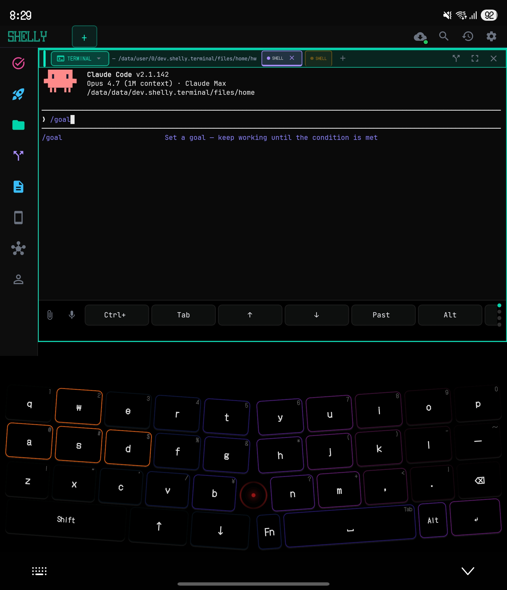

<p align="center">
  
</p>

<h1 align="center">Shelly</h1>

<h3 align="center">
  <code>Terminal + AI + Browser + Markdown</code><br>
  <sub>One screen. Four panes. Zero friction.</sub>
</h3>

<p align="center">
  
  
  
  
  
  
</p>

<p align="center">
  <a href="#quick-start"><b>Quick Start</b></a> &nbsp;&middot;&nbsp;
  <a href="#the-copy-paste-problem"><b>Why Shelly?</b></a> &nbsp;&middot;&nbsp;
  <a href="#features"><b>Features</b></a> &nbsp;&middot;&nbsp;
  <a href="#architecture"><b>Architecture</b></a> &nbsp;&middot;&nbsp;
  <a href="#contributing"><b>Contributing</b></a>
</p>

<br>

<p align="center">
  
</p>

<br>

---

## I can't write code.

I'm not an engineer. I've never written a line of TypeScript. I don't fully understand how Git works internally. I have no formal training in computer science.

But I built this — a 100,000-line terminal IDE — by talking to AI.

Every architectural decision in Shelly is mine. The code is not. It was created through conversation with [Claude Code](https://claude.ai/), running inside [Termux](https://termux.dev/) on a Samsung Galaxy Z Fold6. I direct. The AI builds. No desktop. No laptop. Just a foldable phone and an AI that can execute commands.

The keyboard you see in the screenshots? I built that too. It's called [Nacre](https://github.com/RYOITABASHI/Nacre) — an 11,000-line Android IME written in Kotlin, also created entirely through AI conversation. I'm typing on it right now, inside Shelly, improving both apps simultaneously.

This is not a portfolio project. This is a tool I use every day to build things. And I'm releasing it as open source — not because the code is perfect, but because I believe this represents a new way of making software.

If you find rough edges in the code, that's expected. **Improvements are not just welcome — they're the reason this is open source.**

---

## Quick Start

Download the latest APK from [**GitHub Releases**](https://github.com/RYOITABASHI/Shelly/releases), or build from source:

```bash
git clone https://github.com/RYOITABASHI/Shelly.git && cd Shelly
pnpm install && pnpm android
```

> **Requirements:** Android device. For building from source: Node.js 22+, pnpm, Android NDK r27+. Expo Go is not supported — Shelly uses native Kotlin/C modules.
>
> Termux is no longer required for terminal functionality (Shelly uses a JNI native PTY), but some CLI packages may still require Termux if you want to install additional tools.

On first launch, the Setup Wizard handles permissions and AI configuration. The terminal is ready in under 5 minutes.

---

## The Copy-Paste Problem

You're running Claude Code in the terminal. It throws an error. You copy it. You switch to ChatGPT. You paste. You ask "what went wrong?" You read the answer. You copy the fix. You switch back. You paste. You run it.

**Seven steps. Every single time.**

This is the daily workflow of every developer using CLI-based AI tools. The terminal and the AI live in different worlds, and *you* are the copy-paste bridge between them.

**Shelly puts Terminal and AI panes side by side — and the AI reads your terminal output automatically.**

Say **"fix the error on the right"**. Shelly reads the terminal output, explains the error, and generates an executable command. Tap **[Run]** and the fix lands directly in the Terminal pane.

No copy. No paste. No tab switching. Zero friction.

**Three levels of value:**

- **Single pane:** a native terminal that is faster, smarter, and more usable than Termux alone — with inline content blocks, autocomplete, syntax highlighting, and clickable errors.
- **Split panes:** terminal + AI side by side — the AI reads what the terminal shows and executes fixes with one tap. No copy-paste bridge needed.
- **Full layout:** sidebar + up to 4 pane types + agent bar — a mobile IDE. Browse docs in the browser pane, preview markdown on the right, run agents in the background, and keep your terminal front and center.

---

## How is Shelly different?

Termux gives you a terminal but no AI. ChatGPT gives you AI but no terminal. Replit runs in the cloud. Claude Code on desktop is desktop-only. Shelly is the only tool that puts a native terminal and multi-agent AI side by side on your phone — with a browser pane, markdown viewer, sidebar, and agent bar all in one screen — and connects them so the AI reads your terminal output and executes fixes with one tap.

---

## Features

> **91 features.** Here are the ones that matter most.

### Highlights

| | |
|---|---|
| **Cross-pane intelligence** | Say "fix the error." AI reads your terminal, suggests a fix, one tap to run. Zero copy-paste. |
| **Native PTY (JNI forkpty)** | Kotlin + C, same-process, zero IPC. The only React Native app with an embedded native terminal. |
| **4 pane types** | Terminal, AI, Browser (+ background audio), Markdown. Split up to 4 panes freely. |
| **12 AI agents** | Claude, Gemini, Codex, Groq, Cerebras, Perplexity, Local LLM... auto-routed or `@mention`. |
| **Voice input** | Speak your commands or AI prompts. Full VoiceChain with TTS response. |
| **CRT mode** | Scanlines + phosphor green + flicker. Retro 8-bit sounds. Pixel fonts. Just for fun. |

<details>
<summary><strong>Layout System (5 features)</strong></summary>

- **Single-screen layout** — AgentBar (top) + Sidebar (left, collapsible) + PaneContainer (center, up to 4 panes) + ContextBar (bottom)
- **4 pane types** — Terminal (native PTY), AI (streaming + context injection), Browser (WebView + bookmarks + background audio), Markdown (viewer + renderer)
- **Flexible splits** — 1-pane, 2-pane horizontal/vertical, 3-pane, and 4-pane grid. Resize by dragging dividers
- **Z Fold6 optimized** — Unfolded: 3-pane default layout. Folded: single-pane with swipe switching
- **ContextBar** — Always-visible footer showing current working directory, git branch, and connection status

</details>

<details>
<summary><strong>Cross-Pane Intelligence (8 features)</strong></summary>

- **"Fix the error on the right"** — AI reads terminal output and responds with executable fixes
- **ActionBlock** — Code blocks in AI responses have [Run] buttons that execute directly in the Terminal pane
- **Real-time terminal awareness** — AI pane always knows what is happening in the terminal (wide: automatic, narrow: on reference)
- **CLI Co-Pilot** — Real-time translation of terminal output, approval prompt explanations, second opinions, session summaries
- **Approval Proxy** — Terminal `[Y/n]` prompts become native chat buttons (Approve / Deny / Ask AI). No more typing blind 'Y'
- **Error Summary** — Errors are detected, translated, and surfaced as persistent chat bubbles with [Suggest Fix] buttons
- **Auto-savepoint** — Game-like save/load system. Every change is auto-committed. Revert to any point with one tap
- **Pre-commit security scan** — API keys, private keys, and secrets are detected before they are committed

</details>

<details>
<summary><strong>Terminal Enhancements (10 features)</strong></summary>

- **Fig-style autocomplete** — 30+ top-level commands with subcommand and flag completion, rendered as an inline popup
- **Syntax highlighting** — Command output colorized by content type
- **Clickable paths and errors** — Tap a file path or stack trace line to jump to it
- **Inline content blocks** — JSON, markdown, images, and tables rendered inline inside the terminal output (Command Blocks)
- **CLI notifications** — Long-running commands surface a system notification when they complete
- **Workflow manager** — Named workflows with step-by-step execution and progress tracking
- **SmartKeyBar** — 5 context-adaptive key sets (Default / Vim / Git / REPL / Navigate). Swipe to switch
- **Background Agents** — `@agent` commands scheduled via AlarmManager, run in tmux, report results async. Supports Perplexity / Claude / Gemini / Local
- **Immortal sessions** — tmux keeps your shell alive when the app is backgrounded. Resume any session by name
- **Japanese input in terminal** — Compose CJK characters directly in the terminal pane

</details>

<details>
<summary><strong>AI Pane (7 features)</strong></summary>

- **Multi-agent routing** — Automatically selects the best AI based on the task. Override with `@mention`
- **@mention routing** — `@claude`, `@gemini`, `@codex`, `@cerebras`, `@local`, `@perplexity`, `@team`, `@plan`, `@arena`, `@actions` for direct control
- **Terminal context injection** — AI always has access to the current terminal transcript. No manual copy-paste
- **Inline diff with accept/reject** — AI-suggested file edits are shown as diffs. Accept or reject per hunk
- **Voice input** — Speak your prompt. VoiceChain connects to the full input router and returns TTS response
- **Arena Mode** — Same prompt, two AIs, blind comparison. Vote for the better response, then see which model wrote it
- **Local LLM support** — Run Gemma/Qwen on-device via llama.cpp with guided setup wizard. Full privacy, no API key needed

</details>

<details>
<summary><strong>Browser Pane (4 features)</strong></summary>

- **Full WebView browser** — Navigate any URL inside a pane. Keep docs open while you work in the terminal
- **Bookmarks** — Save and organize URLs. Accessible from the sidebar
- **Background audio** — Audio from browser pane continues playing when you switch to another pane
- **Link capture** — Share any URL to Shelly from Android and it opens in the browser pane

</details>

<details>
<summary><strong>Sidebar (5 sections)</strong></summary>

- **Repos** — Git repository list with branch status
- **Files** — File tree for the current workspace
- **Tasks** — Background agent task list with status and output
- **Ports** — Active localhost ports with one-tap browser pane navigation
- **Profiles** — SSH profile manager and workspace switcher

</details>

<details>
<summary><strong>Cosmetics and Discovery (7 features)</strong></summary>

- **CRT overlay** — GPU-rendered scanlines and screen-curve shader for a retro terminal feel
- **Sound profiles** — Modern / Retro / Silent keyclick profiles
- **7 fonts** — Fira Code, JetBrains Mono, Cascadia Code, Hack, Inconsolata, Source Code Pro, monospace system
- **Haptic toggle** — Per-interaction haptic feedback control
- **Feature catalog** — In-app browser of all 40+ features with search and filter
- **Context hints** — Smart hints based on what is currently on screen
- **Smart command palette** — Fuzzy search across commands, agents, panes, and settings

</details>

<details>
<summary><strong>Infrastructure (5 features)</strong></summary>

- **SSH profiles** — Named SSH connections with key or password auth, accessible from sidebar
- **Workspace isolation** — Per-project cwd, environment, and AI context
- **Settings TUI** — Full settings accessible from a terminal-style text UI as well as the graphical panel
- **8 terminal themes** — Shelly / Dracula / Nord / Monokai / Tokyo Night / Gruvbox / Catppuccin / Solarized
- **PackageDoctor** — Auto-diagnoses package errors and suggests fixes in the AI pane

</details>

---

## The Story

Mobile development never took off — not because phones lack computing power, but because the **input** and **interface** weren't designed for creation.

Chat apps (ChatGPT, Claude, Gemini) can *talk* about code, but they can't *run* it. Terminal emulators (Termux) can *run* anything, but they're hostile to anyone who isn't already a developer.

Shelly fills the gap. You type "make me a portfolio site" in the AI pane, and a real shell runs the commands, generates files, and shows you the results — right next to the terminal that produced them.

### Why Native?

Early versions used ttyd and a WebView. WebSocket connections dropped. Android's Phantom Process Killer terminated background processes. Every time you switched apps, the terminal was dead.

So I directed the AI to throw it all away and go native. Shelly now embeds a native terminal emulator — Kotlin code derived from Termux's own `terminal-emulator` library — connected via a JNI C layer that calls `forkpty()` in the same process. No TCP. No IPC boundary. No socket drops.

As far as we know, this is the **only React Native app in the world** with an embedded native terminal emulator running in-process via JNI.

### Who is this for?

- **Vibe Coders** — Lovable/Bolt/Replit Agent, but on your phone with a real terminal underneath
- **Mobile-first developers** — Claude Code or Gemini CLI, with a proper multi-pane IDE around them
- **Non-engineers with ideas** — Shelly translates everything. Dangerous operations are blocked until you understand them

---

## Architecture

### Screen Layout

```
 ╔══════════════════════════════════════════════════════════╗
 ║  Agent Bar          [Claude] [Gemini] [Local]  [Q] [⚙]  ║
 ╠═══════╦══════════════════════╦═══════════════════════════╣
 ║       ║                      ║                           ║
 ║  S    ║   Terminal Pane      ║   AI Pane                 ║
 ║  i    ║                      ║                           ║
 ║  d    ║   $ npm run build    ║   "Fix the error →"       ║
 ║  e    ║   Error: missing...  ║   The module './utils'... ║
 ║  b    ║                      ║   [▶ Run fix]             ║
 ║  a    ╠══════════════════════╬═══════════════════════════╣
 ║  r    ║                      ║                           ║
 ║       ║   Browser Pane       ║   Markdown Pane           ║
 ║  ───  ║   localhost:3000     ║   README.md               ║
 ║  Repos║                      ║                           ║
 ║  Files║   [YouTube] [GitHub] ║   # Getting Started       ║
 ║  Tasks║                      ║   ...                     ║
 ╠═══════╩══════════════════════╩═══════════════════════════╣
 ║  Context Bar     ~/Shelly  main ↑2  node v22  Native     ║
 ╚══════════════════════════════════════════════════════════╝
```

### Cross-Pane Intelligence

```
┌─────────────────────────────────────────────────┐
│              Shelly (Wide Mode)                  │
│                                                  │
│  ┌──────────────────┐    ┌─────────────────────┐ │
│  │   AI Pane         │    │   Terminal Pane      │ │
│  │                  │    │                     │ │
│  │  User: "fix the  │    │  $ npm run build    │ │
│  │  error on the    │    │  Error: Cannot find  │ │
│  │  right"          │    │  module './utils'   │ │
│  │                  │    │                     │ │
│  │  AI: The error   │◄───│  (transcript injected│ │
│  │  is a missing    │    │   at dispatch time)  │ │
│  │  import path...  │    │                     │ │
│  │                  │    │                     │ │
│  │  ┌───────────┐   │    │                     │ │
│  │  │  Run      │───┼───►│  $ mv util.ts       │ │
│  │  └───────────┘   │    │    utils.ts         │ │
│  └──────────────────┘    └─────────────────────┘ │
└─────────────────────────────────────────────────┘
```

AI reads Terminal. Terminal executes AI. The user just talks.

### Native PTY — JNI forkpty

```
React Native JS
      │
      │  JSI bridge
      ▼
Kotlin NativeModule (TermuxBridgeModule)
      │
      │  JNI call
      ▼
shelly-exec.c  ──── forkpty() ────► shell process
      │                              (bash / zsh / sh)
      │  read/write fd
      ▼
ShellyTerminalView.kt  (Kotlin Canvas renderer)
      │
      ▼
Android SurfaceView  (GPU composited)
```

No TCP. No sockets. No separate process. The shell runs as a child of the app process via `forkpty`, and the PTY fd is read directly from Kotlin via JNI.

---

## Built With

| Layer | Technology |
|-------|-----------|
| Framework | Expo 54 / React Native 0.81 |
| Language | TypeScript (strict) + Kotlin + C |
| UI | NativeWind (TailwindCSS 3) |
| State | Zustand |
| Navigation | expo-router v6 |
| Terminal | Native emulator (Kotlin, Termux-derived) + JNI forkpty (C, same-process) |
| i18n | expo-localization + Zustand (900+ keys, EN/JA) |

---

## Design Philosophy

Shelly was designed by someone who can't use a terminal — for people who can't use a terminal.

Every design decision comes from the question: *"If I don't know what this command does, how should the app protect me and teach me at the same time?"*

The cross-pane system comes from: *"Why do I have to copy an error from one window and paste it into another?"*
The native terminal comes from: *"Why does the terminal die every time I switch apps?"*
The approval proxy comes from: *"Claude is asking me to approve something in English. I don't know what it means."*
The VoiceChain comes from: *"I can't type on a phone keyboard fast enough to keep up with my ideas."*
The layout system comes from: *"Why can't I have a browser, a terminal, and an AI all on the same screen at the same time?"*

Every limitation became an innovation that engineers need just as much.

Read the full design philosophy: **[docs/DESIGN_PHILOSOPHY.md](docs/DESIGN_PHILOSOPHY.md)**

---

## Contributing

This started as a personal tool. Community contributions are shaping it into a true OSS project.

**Looking for a first contribution?** Check the [`good first issue`](https://github.com/RYOITABASHI/Shelly/issues?q=is%3Aissue+is%3Aopen+label%3A%22good+first+issue%22) label:

- [Set up Jest test framework](https://github.com/RYOITABASHI/Shelly/issues/5) — foundational, unblocks all test work
- [Add unit tests for input-router.ts](https://github.com/RYOITABASHI/Shelly/issues/1) — pure functions, easy to test
- [Add unit tests for command-safety.ts](https://github.com/RYOITABASHI/Shelly/issues/2) — security-critical, great for TDD
- [Add unit tests for auto-savepoint.ts](https://github.com/RYOITABASHI/Shelly/issues/3) — git operations, secret detection
- [Translate Japanese code comments to English](https://github.com/RYOITABASHI/Shelly/issues/4) — one file per PR is fine
- [Flesh out CONTRIBUTING.md](https://github.com/RYOITABASHI/Shelly/issues/6) — development setup guide

**Key files to explore:**

- `lib/input-router.ts` — The brain. Classifies natural language into shell commands, AI requests, or @mentions
- `lib/command-safety.ts` — Risk assessment engine. Blocks dangerous commands with 5 severity levels
- `lib/auto-savepoint.ts` — Watches for file changes and auto-commits. The "game save" system
- `modules/terminal-view/android/.../ShellyTerminalView.kt` — The native terminal renderer (Kotlin + Android Canvas)
- `modules/termux-bridge/android/src/main/jni/shelly-exec.c` — The JNI forkpty layer

If you find something that could be better — a cleaner pattern, a performance optimization, a bug fix — **please open an issue or PR**. That's exactly why this is open source.

Read the contributing guide: **[CONTRIBUTING.md](CONTRIBUTING.md)**

---

## Vision

Mobile terminals are about to become standard. Most developers don't see it yet.

Modern mobile SoCs have NPUs pushing 40+ TOPS. Local LLMs that required a desktop GPU two years ago now run on phones. Soon, 7B-13B parameter models will run natively on mobile at acceptable speeds.

When that happens, you'll have zero-cost AI-assisted development, complete privacy, and development anywhere — airplanes, remote sites, commutes.

Shelly was built for that future. Local LLM integration is already implemented. The native terminal is already there. The multi-agent routing already supports local models alongside cloud APIs. The layout system already handles the screen real estate of foldables and tablets.

The question isn't whether mobile development will happen. It's who builds the tools for it first.

---

## About the Creator

**RYO ITABASHI** — Creative Director at [Rebuild Factoryz](https://rebuildfactoryz.com/). Branding and design are my profession. Code is not.

I built Shelly because I wanted to use Claude Code on my phone, but Termux was too intimidating. So I made a chat interface that hides the terminal complexity while keeping its full power. Then I realized the real problem wasn't the terminal itself — it was the gap between the terminal and the AI. So I connected them. Then the WebView kept dying, so I directed the AI to replace the entire rendering layer with a native terminal emulator. Then I realized I needed a browser pane, a markdown viewer, a sidebar, and a proper layout system to make it a real IDE.

100,000 lines later, I still can't write code. But I can describe what I need, and the AI builds it.

The keyboard in the screenshots is **Nacre** — a split-layout Android IME I built (also through AI) to solve the input problem on mobile. Shelly handles the interface. Nacre handles the input. Together, they make phone-only development actually possible.

Both were developed entirely on a Samsung Galaxy Z Fold6, in Termux, without ever touching a desktop computer.

---

## Known Limitations

- **No offline mode** — Cloud AI features require an internet connection. Local LLM support works offline, but the default experience assumes connectivity.
- **Additional tools beyond the bundle** — Shelly ships with bash, Node.js 22, Python 3.12, git, curl, and sqlite3. For tools outside this set, Termux can be used alongside Shelly.
- **@team routes to multiple APIs** — When using `@team`, Shelly queries multiple AI providers simultaneously. This consumes API credits on each provider. A cost warning is displayed before execution.

---

## Security

Shelly runs commands on your device. The safety system is a best-effort layer, not a guarantee.

- **Command safety is regex-based** — The 5-level risk assessment uses pattern matching. It catches common dangerous patterns (`rm -rf /`, `dd if=`, etc.) but is not a sandbox. Treat it as a seatbelt, not a firewall.
- **APK distribution is unsigned** — Release APKs from GitHub Actions are not code-signed. For verified builds, clone the repo and build locally with your own keystore. See [Building from source](#quick-start).
- **The autonomous agent requires explicit user approval for each action** — When using CLI agents (Claude Code, Gemini CLI) through Shelly, all file writes and command executions go through the approval proxy. The "all" auto-approve mode shows a security warning before activation.
- **API keys are stored in SecureStore** — Keys are never written to logs or debug output. SecureStore uses Android Keystore encryption on supported devices.

To report a security issue, please open a [GitHub issue](https://github.com/RYOITABASHI/Shelly/issues) with the `security` label, or contact the maintainer directly.

---

## Privacy

- **User profile learning** — Shelly observes your command patterns and AI usage to personalize suggestions (`lib/user-profile.ts`). This data stays on-device in AsyncStorage. However, when you send a message to a cloud AI, the profile context is included in the API request to improve response quality. You can disable profile learning in Settings.
- **No telemetry** — Shelly does not phone home. No analytics, no crash reporting, no usage tracking. The only network traffic is your explicit AI API calls.
- **Local LLM mode** — For fully private usage, configure a local model (Gemma/Qwen via llama.cpp). All processing stays on-device.

---

## License

[GPLv3](./LICENSE) — Copyright (c) 2026 RYO ITABASHI

This project includes code derived from [Termux](https://github.com/termux/termux-app) (GPLv3), specifically the terminal emulator rendering layer.
