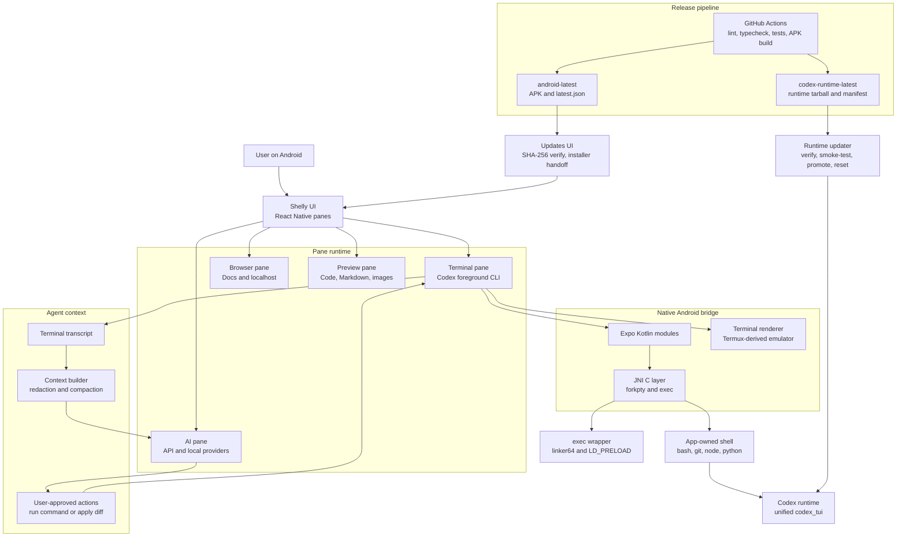
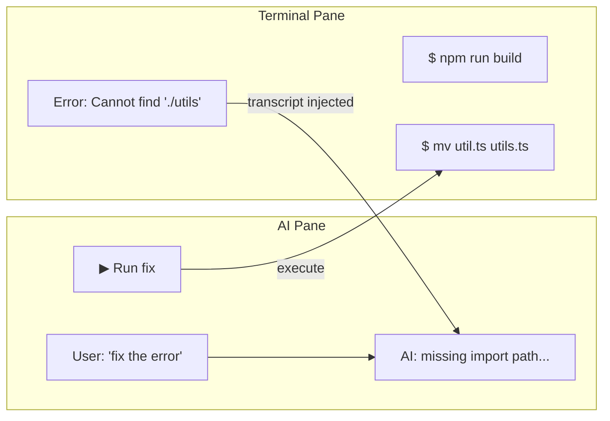

<p align="right"><a href="README.ja.md">日本語で読む</a></p>

<p align="center">
  
</p>

<h1 align="center">Shelly</h1>

<h3 align="center">
  Shelly turns an Android phone — folded or unfolded — into a self-contained agent machine.<br>
  <sub>Describe a task in plain language, and it wakes on its own alarm — screen off — and does the work with your own AI accounts, local LLMs, and a real terminal underneath. No cloud runner. No PC. No Termux.</sub>
</h3>

<p align="center">
  <sub><em>Honesty first: the full unattended cycle has been observed end-to-end <b>once, on a Galaxy Z Fold6 (N=1)</b> — the <a href="#status">Status</a> table tracks exactly what is and isn't verified from here on.</em></sub><br>
  <sub><b>Underneath the agent is why you can trust it:</b> a full native terminal IDE — the real Codex CLI in an app-owned JNI PTY, bash / git / Python 3 / Node.js bundled in the APK, and API-backed AI panes (Gemini, Cerebras, Groq, Perplexity, local models) beside it. Everything the agent does runs in the same on-device shell you can open, inspect, and drive by hand. No Termux install, no distro bootstrap, no WebView terminal, no remote IDE bridge.</sub>
</p>

<p align="center">
  <a href="https://github.com/RYOITABASHI/Shelly/actions/workflows/build-android.yml"></a>
  
  
  
  
  
  <a href="https://buymeacoffee.com/ryo1221"></a>
</p>

<p align="center">
  
</p>

<p align="center">
  <a href="#see-it-run"><b>Demo</b></a> &nbsp;&middot;&nbsp;
  <a href="#quick-start"><b>Quick Start</b></a> &nbsp;&middot;&nbsp;
  <a href="docs/MANUAL.md"><b>Manual</b></a> &nbsp;&middot;&nbsp;
  <a href="#why-shelly"><b>Why Shelly?</b></a> &nbsp;&middot;&nbsp;
  <a href="#features"><b>Features</b></a> &nbsp;&middot;&nbsp;
  <a href="#architecture"><b>Architecture</b></a> &nbsp;&middot;&nbsp;
  <a href="#release-integrity"><b>Release Integrity</b></a> &nbsp;&middot;&nbsp;
  <a href="#status"><b>Status</b></a> &nbsp;&middot;&nbsp;
  <a href="#contributing"><b>Contributing</b></a> &nbsp;&middot;&nbsp;
  <a href="#support"><b>Support</b></a>
</p>


<br>

---

## See it run

**Registering an autonomous agent from the home-screen widget — no need to open the app**

https://github.com/user-attachments/assets/fbda309f-ad12-4a6d-a5b8-96b6ee4d4e57

Type or speak `@agent ...` straight into the Scouter widget's ASK box. It routes through the exact same confirm flow as typing into the AI pane — same parse, same confirm card — then shows up in the scheduled-agent list with its next run time.

<br>

**The terminal underneath: a real AI coding CLI running natively on Android**

https://github.com/user-attachments/assets/c87ea206-12f8-4b21-9089-0a373b0e8a2a

No Termux. No proot. No remote dev server. OpenAI Codex — a real, full-featured coding CLI — invokes directly through Shelly's own JNI PTY, the same native terminal you can open and drive by hand.

**Unfolded: sidebar, terminal, AI, browser, and preview, all live at once — the same session, not four separate apps**

<p align="center">
  
</p>

---

## Why Shelly?

Most of what exists today only covers one piece of this. A terminal app (like Termux) gives you a shell but no AI built in. An AI chat app gives you a smart assistant with no shell underneath it and no access to your files. A cloud coding workspace (like Replit) gives you both, but on a rented computer far from your device. Cloud "agents" run the same way — somewhere else, on files that aren't yours.

Shelly's bet: the phone in your pocket is already the best agent host you own — always on, always with you, and already holding your files, your accounts, your context. Shelly turns it into a self-contained agent machine, and grounds that agent in a real terminal IDE so you can see, verify, and drive by hand everything it does on its own.

**Two layers, one trust chain:**

- **The agent layer** — say what you want in plain language; Shelly registers a scheduled agent that wakes on an AlarmManager alarm, screen off, runs on your own keys and local models, and reports when it ran. ([details](#autonomous-agents) — and the [Status](#status) caveats that go with them)
- **The terminal layer** — everything the agent can do runs through the same on-device shell and toolchain you use interactively: an app-owned native PTY, the real Codex CLI, bundled bash / git / Python / Node. The agent isn't a cloud sandbox you take on faith; it's your own machine, inspectable down to the transcript.

### The copy-paste problem

You're running an AI coding tool in a terminal — Codex, or any other AI CLI. It throws an error. You copy it. You switch to ChatGPT. You paste. You ask "what went wrong?" You read the answer. You copy the fix. You switch back. You paste. You run it.

**Seven steps. Every single time.**

This is a familiar workflow for developers using CLI-based AI tools. The terminal and the AI live in different worlds, and *you* are the copy-paste bridge between them.

**Shelly puts the terminal and the AI side by side. The AI reads your terminal output automatically.**

Say **"fix the error on the right"**. Shelly reads the terminal output, explains the error, and generates an executable command. Tap **[Run]** and the fix lands directly in the Terminal pane.

No copy. No paste. No tab switching.

**Four levels of value:**

- **Single pane:** a native terminal that is faster, smarter, and more usable than Termux alone — with content blocks, syntax highlighting, and clickable errors.
- **Split panes:** terminal + AI side by side — the AI reads what the terminal shows and executes fixes with one tap. No copy-paste bridge needed.
- **Full layout:** sidebar + up to 4 live panes + agent bar — a mobile IDE. Browse docs in the browser pane, preview code or markdown on the right, use API-backed agents in the background, and keep your terminal front and center.
- **Unattended:** register a plain-language scheduled agent — the same machinery runs while the phone sits in your pocket, and tells you when it ran.

**On a foldable, that full layout is the default rather than an aspiration.** Folded, Shelly is a single-pane terminal. Unfold, and the same live shell expands into a sidebar plus up to four panes in a 2×2 grid — terminal, AI, browser, preview — without restarting the session. Shelly is developed daily on a Galaxy Z Fold6, which is why the unfolded layout is the design target and not an afterthought. (Rapid fold ↔ unfold during an active CLI stream is still listed under [Known Limitations](#known-limitations).)

---

## Important Android Notes

- **APK is ~800 MB** because Shelly bundles real tools, not shims. bash,
  Node.js, Python 3, git, curl, ripgrep, jq, tmux, vim, less, sqlite3,
  make, ssh — plus the OpenAI Codex CLI runtime — ship inside the APK.
  No Termux, no repository server, no package manager bootstrap. First
  launch extracts the binaries into app-private data.
- **All files access** is requested on first launch so `/sdcard` works
  the way a desktop terminal expects (`cd /sdcard/Download`, editing
  files there, etc.). Scoped Storage without this permission silently
  blocks writes. You can refuse — Shelly still works inside its own
  sandbox, but `/sdcard` paths will `Permission denied`.
- **LD_PRELOAD + /system/bin/linker64** is how Shelly runs Linux-layout
  binaries on Android bionic (SELinux blocks direct execve on
  app-private ELFs). The wrapper rewrites `/bin/X` and `/usr/bin/X` to
  `/system/bin/X` and routes app-bundled ELFs through `linker64`. Source
  is in `modules/terminal-emulator/android/src/main/jni/exec-wrapper.c`.
- **Not Termux-compatible by design.** Shelly does not use Termux
  packages, Termux paths, or Termux's prefix assumptions. If you already
  have Termux installed, Shelly still bundles its own copies of
  everything. No conflict, but also no sharing.

---

## Quick Start

### Install

Download the current Android APK from [**GitHub Releases**](https://github.com/RYOITABASHI/Shelly/releases). The rolling `android-latest` release is the source of truth for the newest Shelly build, and the latest tagged `vX.Y.Z` release APK is cut from that same build — the exact `versionCode`, commit, and SHA-256 are live in [`android-latest/latest.json`](https://github.com/RYOITABASHI/Shelly/releases/download/android-latest/latest.json).

After the first install, Shelly can update itself from inside the app: open the cloud-download button in the top bar or **Settings → Updates**. Shelly reads the public `android-latest/latest.json` manifest, compares Android `versionCode`, enqueues the APK with Android DownloadManager under `/sdcard/Download/shelly-update-<versionCode>/`, verifies SHA-256, then opens Android's package installer. The system download keeps running if Shelly is backgrounded or restarted. Android still asks you to confirm the install because Shelly is distributed outside the Play Store.

Expo OTA is disabled for release APKs. JS, native, and bundled-tool changes ship together through a new APK so the installed binary and app code stay in sync.

### Build from source

```bash
git clone https://github.com/RYOITABASHI/Shelly.git && cd Shelly
pnpm install && pnpm android
```

**Requirements:**

- Android device
- Node.js 22+ (CI currently builds on Node 22)
- pnpm
- Android NDK 26.1.10909125 (or an Android SDK/Gradle setup that resolves that pinned NDK)

Expo Go is not supported — Shelly uses native Kotlin/C modules.

Termux is not required. Shelly ships with bash, Node.js, Python 3, git, curl, ssh, sqlite3, tmux, vim, less, jq, make, and ripgrep. For tools beyond the bundled set, Termux can be used alongside Shelly.

### First launch

On first launch Shelly asks for **All files access** so the terminal can read scripts in `/sdcard/Download` and anywhere else on your phone. Tap **Allow** and you're done — `source /sdcard/Download/foo.sh` just works. Shelly is distributed through GitHub Releases for now; Play Store / F-Droid submission is still future work.

### Configure AI

After that, open **Settings → API Keys** (or run `shelly config` from the terminal pane) to paste API keys for Gemini, Cerebras, Groq, Perplexity, OpenRouter, OpenAI-compatible local servers, or other explicit API providers. Keys are stored in `expo-secure-store` and never written to logs.

### Sign in

Shelly's foreground AI CLI is **Codex**. Everything else is an API provider you configure with a key.

| Surface | How to sign in | Notes |
|---|---|---|
| **Codex CLI** (ChatGPT subscription) | Run `codex`, or `codex-login --open` directly | The supported foreground CLI. If `~/.codex/auth.json` is missing or invalid, the `codex` wrapper starts Shelly's device-code login, opens the OpenAI device-code page in the in-app Browser Pane, writes `~/.codex/auth.json` (mode `0600`) on success, then launches the normal Codex TUI. No OpenAI API key required — this rides your ChatGPT subscription. |
| **API providers** (Gemini, Cerebras, Groq, Perplexity, OpenRouter, local) | **Settings → API Keys** or `shelly config` | Paste a key per provider for AI-Pane / `@mention` / `@team` / background-agent use (OpenRouter is attended-only). Keys live in `expo-secure-store`. Local/OpenAI-compatible servers need only a base URL. |

> **Codex login note.** `codex /login` inside the REPL is not the supported path on Shelly. Use bare `codex` and let Shelly's wrapper launch device-code auth, or run `codex-login --open` from bash.

### Bundled Shelly commands

| Command | Use |
|---|---|
| `codex` | Launch the foreground Codex TUI in the native terminal. If auth is missing, Shelly starts the device-code login flow first. |
| `codex-login --open` | Start ChatGPT subscription device-code auth and open the verification page in Shelly's Browser Pane. |
| `shelly-doctor` | Check shell/native binary presence, bundled Codex binaries, JS dispatcher, local LLM endpoints, and Codex auth file presence. |
| `shelly-codex-diagnose` | Run deeper Codex smoke/canary/edit/patch diagnostics. |
| `shelly-update-clis codex --check-only` | Probe the active Codex runtime. Runtime installs are normally driven by the Updates UI. |
| `shelly-cs` / `cs` | GitHub Codespaces helper commands. |

**First thing to try:** once a provider key is set, type `@agent` in any pane followed by a plain-language instruction and a time — e.g. `@agent every day at 8am, collect the latest STEAM×AI education papers and news, summarize them, and save to Obsidian`. Shelly turns that into a scheduled on-device agent (see [it run above](#see-it-run)).

---

## Runtime model

Under the agent sits Shelly's structural advantage: the runtime itself — a native PTY and a managed Codex CLI running in the same on-device shell as your files, with API-backed agents layered on top. Not a WebView terminal, not a remote IDE client.

If your AI coding CLI workflow stalled in Termux, proot, or another Android terminal setup, Shelly gives you a maintained on-device environment built around the constraints of real Android devices (bionic libc, `linker64` exec rules, SELinux on `app_data_file`).

No fragile terminal stack. No WebView terminal crashes. No copy-paste-driven workflow.

- **Native execution path** — Codex runs through Shelly's app-owned native PTY (JNI `forkpty`), not a remote bridge or socket terminal.
- **Managed latest, not blind latest** — Shelly ships a pinned Codex runtime in each APK, and the Updates UI can install a newer verified Codex runtime from the rolling `codex-runtime-latest` release without waiting for the next APK.
- **Visible state** — the app can show recent terminal logs, so version drift and startup failures are easier to debug on the device itself.
- **Compliance boundary** — Codex is a foreground, user-controlled terminal CLI. AI-Pane / background automation uses explicit API providers; it does not run a hidden subscription worker.

This is the part that makes Shelly more than a terminal skin. It is the reason the app can ship a fast-moving CLI on Android without turning the user into the update mechanism.

### Release surface

| Surface | Status | What that means |
|---|---|---|
| **Codex CLI** | Supported | The foreground CLI. Bare `codex` launches the normal Codex TUI after Shelly verifies or creates `~/.codex/auth.json` through in-app device-code auth, running over the native PTY. |
| **AI Pane / background agents** | Supported through APIs | Uses configured providers: Gemini API, Cerebras, Groq, Perplexity, OpenRouter (attended AI-Pane use only), and local OpenAI-compatible servers. Provider-key based, no hidden subscription reuse. |
| **Gemini API** | Supported where configured | Available for the AI Pane, `@gemini` routing, `@team`, multimodal/API-backed tasks, and background agents when a Gemini API key is set. (This is the API provider — there is no bundled Gemini CLI.) |

---

## What Shelly is not

Shelly is not a Termux skin, a WebView terminal, or a remote IDE client. It owns the Android terminal stack inside the app, runs Codex on-device in the same shell as your files, and layers API-backed agents next to that terminal instead of forcing you through copy/paste or a cloud workspace.

It is also not a cloud agent service. Scheduled agents run on the device, on your keys, with no server-side component and no subscription runner — if the phone is off, nothing pretends otherwise, and missed runs are surfaced instead of hidden.

It is also not a messaging-platform bot operator. There's no Discord bot, no Slack app, no WhatsApp/Signal Business API integration, and none planned — that's the server-resident-bot model a service like Hermes runs, and it needs a server Shelly doesn't have. The substitute is on-device: the notification-triggered-agent channel (`lib/notification-inbound.ts`) reacts to any app's Android notification — package allowlist, exact sender-name match, tainted-input only, never treated as instructions — so it covers LINE, Discord, Slack, WhatsApp, Signal, or anything else that posts a notification, with no per-platform bot registration or approval process for any of them.

No Termux install. No proot. No ttyd. No remote bridge. No cloud runner.

---

## Features

> Features below describe implemented paths in the current build. Items with limited device validation (e.g. unattended agent firing, TTS playback, cross-OEM reliability) are caveated here and in [Status](#status) / [Coming Soon](#coming-soon).

### Highlights

| | |
|---|---|
| **On-device autonomous agent** | Say it in plain language → a scheduled agent runs on the phone *by itself* (screen off), on your own keys and tools, and tells you when it ran. It works where a cloud agent can't reach — your files, terminal, local LLM, the device itself. *N=1 verified so far — see [Status](#status).* ([details](#autonomous-agents)) |
| **Shelly companion** | The default local-persona AI Pane is one persistent companion named **Shelly**, not a provider-branded form — no provider tag on any reply. Its conversation follows you across AI panes and splits, auto-distills what you talked about into its own memory whenever you switch providers (browsable/editable in Settings), remembers confirmed preferences for itself and every background agent, and adds completed agent results to the same thread automatically. Explicit provider routes keep their own per-pane histories, with a short carry-forward of recent context when you switch into or out of them. |
| **Multi-platform delivery** | An agent's output isn't limited to a notification or an Obsidian draft — it can post directly to Bluesky, Discord, Slack, Telegram, Mastodon, Misskey, WordPress, or X, or call a webhook. Store each platform's key once, then point an agent at it in plain language. *Bluesky is verified live end-to-end.* |
| **Notification-triggered agents** | An agent can also fire when another app posts a matching notification — LINE, Discord, Slack, whatever you allowlist — instead of only on a schedule. Package allowlist gates first, an exact sender-name match narrows it further (fail-closed if unset), and the triggering text is always injected as tainted, untrusted data, never instructions. Separately, the opt-in **Telegram inbound gateway** (off by default) accepts `@agent` messages from one authorized chat and queues a confirmation card; its authorization/sanitization core is tested, but the real bot-token long-poll → confirm flow has not been live-tested. |
| **Agent browser automation** | An agent can click, fill, or extract text from the page already open in the Browser pane — a deliberately narrow action set (no navigation, no arbitrary script injection), gated to an explicit page-URL allowlist and a per-action approval tap; page-derived output is always treated as untrusted at the next capability boundary. |
| **Cross-pane intelligence** | Say "fix the error." AI reads your terminal, suggests a fix, one tap to run. Zero copy-paste. |
| **AI → Terminal insert** | Any AI-chat reply's fenced ` ```bash ` block gets an **Insert** button next to Copy — tap it and the code lands in the focused Terminal pane's input line (no auto-Enter, review before running); opens a new terminal and queues the insert if none is open. *On-device verified 2026-08-31.* |
| **Nacre Bridge** | While Shelly is foregrounded, it shares sanitized live terminal context (cwd, git branch, a handful of safe recent-command terms — never raw commands or secrets) with [Nacre](https://github.com/RYOITABASHI/Nacre), the author's own Android IME, so its kana-kanji conversion can lean toward what you're actually doing; the context file is deleted the moment Shelly leaves the foreground. On Nacre's own side, its Dev Mode detects focus inside Shelly specifically and suppresses auto-punctuation conversion, defaulting its symbol panel to a programming tab instead. Requires Nacre installed; toggle in Settings → Nacre Bridge (on by default). *On-device verified 2026-08-31.* |
| **AI Edit golden path** | Tap a file in the sidebar → preview it → hit `[✨ AI]` → describe the change → accept per hunk → the file is rewritten on disk, the preview reloads automatically. |
| **Codex apply_patch on-device** | Codex file edits land through the agent's native patch tool on Android, not a shell-only fallback. |
| **Native PTY (JNI forkpty)** | Kotlin + C, direct PTY fd, no TCP/socket bridge — an embedded native terminal, not a WebView terminal. |
| **Batteries included** | bash, Node.js, Python 3, git, curl, ssh, sqlite3, tmux, vim, less, make, ripgrep, jq ship inside the APK. Termux not required. |
| **9 pane types** | Terminal, Agent Chat, AI, Browser (+ background audio), Markdown, Preview, Ask, Agent Runs, and Memory Workbench. Split up to 4 live panes freely. |
| **Multi-agent AI** | API-backed Gemini, Cerebras, Groq, Perplexity, OpenRouter, Local LLM, plus the foreground Codex terminal CLI. Auto-routed or `@mention` where supported. |
| **Local LLM (on-device, llama.cpp)** | Qwen3.5 models run on-device through the bundled llama.cpp / llama-server flow. Qwen3.5-0.8B ships as the actual default (light enough to stay always-on for background/autonomous use); Qwen3.5-2B is the recommended step-up for on-demand use when you can spare the RAM/battery, Qwen3 1.7B sits between the two, and 4B+ models are reserved for short quality checks. |
| **Codex on Android** | Shelly keeps Codex on a managed-latest path without trusting upstream blindly: each APK bundles a pinned runtime, the Updates UI can promote verified runtime releases, and Reset falls back to the bundled runtime. Codex runs over the native PTY with a Shelly-owned device-code login wrapper. No proot, no root. |
| **Scouter home widget** | A home-screen agent launcher and health list — up to 3 upcoming scheduled agents, each with a status glyph (last run's success/error/skipped) and next-fire time, without opening the app. It is interactive: **RUN** starts that already-registered agent through the unattended execution gates; **ASK** can also register a brand-new agent — type or speak `@agent ...` and it routes through the same confirm flow as typing it in the AI Pane. |
| **Color themes** | Blue / Red / Purple / Green palettes run on the existing preset IDs, so runtime swaps keep your shell alive without settings migration. |
| **Voice input** | Speak your commands or AI prompts. Groq Whisper handles transcription, then VoiceChain routes the text through the same input router the keyboard uses. |

### Autonomous agents

Say what you want in plain language; Shelly registers a scheduled agent that runs **on the device, by itself** — even with the screen off. It wakes via Android **AlarmManager** (`setExactAndAllowWhileIdle`, designed to fire under Doze, unlike cron-under-Termux), runs on-device with **your own keys and tools**, and **tells you when it ran** (notification + per-agent next/last-run, with a missed-run warning if an expected run didn't record).

The wedge isn't "smarter than a cloud agent" — it's that it **works where a cloud agent can't reach**: your files, your terminal/scripts, your local LLM, the phone itself.

It's a **capability you point at your own tools**, not a fixed feature. One example (mine):

```
@agent every day at 8am, collect the latest STEAM×AI education papers and news,
and write the primary-source links + a short summary to my Obsidian vault
```

The schedule above registers an agent that, when it fires, wakes the phone, researches via Perplexity, and drops a dated, sourced summary into Obsidian — unattended, the same run shown in the demo above. Swap in your own schedule, source, and output.

Scheduling also understands a relative *start*, not just a recurrence — "starting next week, check the news every morning" registers the agent now but holds its first fire until the resolved date, instead of running tomorrow by mistake. (Confirmed on-device for the registration/confirm-card path.)

If the request itself is too vague to act on — "help me out" with no object or domain — Shelly asks what you actually want done *before* it asks when to run it, instead of scheduling an agent with an empty task.

**Honest caveat:** unattended firing depends on Android's background limits, which vary by manufacturer (Samsung / Xiaomi / Oppo / OnePlus battery-freezers). Shelly uses Android's highest-priority alarm path (named above) and surfaces missed runs, but it can't *guarantee* a fire on every device — grant the battery-optimization exemption and check the agent's run view.

### Learning loop

Registering an agent isn't a fixed form. When what you asked for is ambiguous, an LLM — not a hardcoded pipeline — drives the rest of the conversation in its own words, asks follow-up questions one at a time, and only proposes a final registration once it believes it has enough (**LLM-Led Agent Registration**, on by default, toggle in Settings → Agents; tries a fast cloud provider first if you've configured one, then falls back to the on-device model, then to Shelly's fixed one-field-at-a-time prompts if nothing is reachable — so the conversation degrades gracefully instead of getting stuck). A request that turns out to have several ordered steps ("look this up, summarize it, then post it") is kept as a real multi-step chain — the same orchestration engine deterministic registration already used — instead of being collapsed into one prompt. Every value the model proposes is still independently re-checked before it's trusted: a schedule phrase is re-parsed by the same deterministic cron logic every other path uses, a posting destination has to match a connector you actually registered, and a webhook URL or shell command is only accepted when it's a literal, character-for-character copy of something you typed in that same conversation — never something the model invented. The human confirmation tap is never skipped, no matter which path produced the draft.

Agents also get better with use, on-device, without a server:

- **Skill distillation** — after a successful run, Shelly can distill it into a reusable "skill recipe" (a markdown file, GLOBAL across agents, not tied to the one that created it) and offers to save it; a later task that matches gets the recipe recalled and reused instead of solving the same problem from scratch. Nothing saves silently — you always see what would be kept.
- **Skills catalog** — the Sidebar's **Browse Catalog** action fetches Shelly's first-party catalog of importable skill recipes, verifies each download, and places it in the same quarantine/review flow as a local skill import; catalog availability follows the published `skills-catalog-latest` release.
- **Persistent memory** — agents can write and recall small facts across runs ("remember that…"). Per-agent writes now use the encrypted MEMORY-001 store by default, with the older markdown/Obsidian path retained as a fallback; shared `_global` writes still use that older path. See [Privacy](#privacy) for the current storage and verification limits.

### The Companion

<p align="center">
  
  
</p>

Shelly keeps its own journal. Whenever a pane switches away from it, it writes a digest of that conversation for itself; anything you ask it to remember is recalled by the companion and every background agent — and you can read, edit, or delete all of it from **Settings → Companion Memory**, reachable even before you've registered a single agent. Switch a pane to an explicit provider mid-conversation and Shelly carries the last few messages along with it, so the new provider already has the thread's context on its very first reply — same companion, different brain.

### Scouter Widget

<p align="center">
  
</p>

Scouter is Shelly's home-screen agent launcher and health list. It shows up
to 3 upcoming scheduled agents (name, last-run status glyph, next-fire time)
and lets you run one, or register a new one via ASK, without opening the app.
An earlier version of this widget also carried a live Codex session HUD
(status/DOING line, token/context/rate-limit cells, local LLM health row) plus
Allow/Deny and numbered-choice pills that wrote straight to the foreground
Codex PTY — that was deliberately removed in a 2026-07-18 redesign to keep the
widget a launcher, not a second copy of the terminal; approvals and choices
are still available through Codex notification channels and the in-app Agent
Chat pane (see [docs/FEATURES.md](docs/FEATURES.md)).

See [docs/FEATURES.md](docs/FEATURES.md) for the full feature-by-feature breakdown (Scouter Widget internals, Layout System, Cross-Pane Intelligence, Agent Chat, AI Edit, Terminal Enhancements, AI Pane, Browser Pane, File Tree, Preview Pane, Sidebar, Command Palette, Theme & Fonts, Git Integration, Settings/API Keys/Background Agents).

### Codex Runtime

<p align="center">
  
</p>

- **Native runtime** — the npm `@openai/codex` package is only part of the JS dispatcher story. Release APKs bundle the pinned Android-native unified `codex_tui` binary from `.ci-versions/`, and runtime updates install the same shape under `~/.shelly-runtime/codex/current`.
- **Managed promotion** — a new runtime candidate is promoted only after download, SHA-256 verification, extraction, executable checks, and `codex_tui --version` / `codex_tui exec --help` smoke checks.
- **Repair / reset path** — if the app-data runtime is broken or unwanted, the Updates UI can repair it from the latest runtime release or reset to the APK-bundled Codex runtime.

---

## Status

Full verification log with dates, devices, and evidence for every area: **[docs/STATUS.md](docs/STATUS.md)**. The core terminal, layout, AI Edit, and agent-registration paths are broadly shipping and re-verified on-device across many passes; below is what's most worth knowing before you rely on something specific.

| Area | State |
|---|---|
| Core terminal — native PTY, multi-pane layout, AI Edit golden path, FileTree/git, Command Palette | ✅ shipping, broadly on-device verified |
| Background/autonomous agents — `@agent` registration → unattended AlarmManager fire → notify | ✅ wired; unattended firing confirmed end-to-end on one real device (Z Fold6, N=1) — cross-OEM background-limit reliability not yet broadly tested |
| Sub-agent fan-out (`parallelGroup`) — isolated branch context, concurrent unattended dispatch | ✅ on-device verified 2026-08-17 via a real 3-branch concurrent AlarmManager fire |
| Nacre Bridge — live terminal context shared with the author's own Nacre IME, plus Nacre-side Dev Mode | ✅ on-device verified 2026-08-31 |
| Agent social-post connectors — Bluesky, Discord, Slack, Telegram, Mastodon, Misskey, WordPress, X | ✅ Bluesky verified live end-to-end; X is integration-tested but not yet fired against a live billing-enabled account; the rest ship on the same path but haven't each been fired against a real account |
| Distribution | 🟡 GitHub Releases only (`android-latest`); no Play Store / F-Droid listing yet |

---

## Coming Soon

Parts of the app are written but not yet verified. These are on the short-term roadmap, not in the current build:

- **Play Store / F-Droid distribution** — the APK is published via GitHub Releases only; store submission flow not yet done
- **Cross-OEM autonomous-agent reliability** — unattended scheduled firing is observed on the Z Fold6 (N=1), but Android background limits vary by manufacturer (Samsung / Xiaomi / Oppo / OnePlus battery-freezers); broad cross-device reliability + a device health/permission checklist are not done yet
- **Snippet authoring UI** — the Command Palette shows the first 20 entries from your snippet store and dispatches them to the terminal, but the in-app create/import/edit flow was removed in an earlier cleanup pass. Snippets are stored in Android's AsyncStorage (`store/snippet-store.ts`), not a plain file — there is currently no supported way to bulk-add them outside the (removed) in-app UI.

---

## The Story

### I don't hand-write code.

I'm a Creative Director, not an engineer by training. Every line in this repo was generated by AI under my direction — through conversation with AI coding agents on a Samsung Galaxy Z Fold6, no desktop, no laptop — then reviewed, tested on-device, and shipped. Every architectural decision is mine. The keystrokes are not. What I bring is twenty years of product judgment about what belongs on a screen and what doesn't — and that turns out to be most of the job.

That's the origin story. It is deliberately **not** the trust story — "an AI wrote it" is a reason to hold the code to a *higher* verification standard, not a lower one. You're deciding whether to give this app shell execution, broad storage, and your API keys, so the honest answer to "why trust it?" is the discipline around the code, all of which is auditable in this repo:

- **On-device verification before "done."** Features aren't marked shipped until they've been observed working on real hardware, and single observations stay labeled as such — the N=1 caveats in this README's [Status](#status) table are that policy in public.
- **Tests that execute the real code.** The agent pipeline's regression tests run the actual generated scripts with real processes — real bash execution, real HTTP-failure surfaces — instead of hand-copied re-implementations that can silently drift from what ships.
- **Adversarial review before risky merges.** Native, OAuth, IPC, and security-boundary changes get an explicit second-agent review pass before they land; the signed-approval channel and the autonomous-agent execution gates went through dedicated security reviews.
- **An engineering ledger instead of vibes.** [`docs/superpowers/DEFERRED.md`](docs/superpowers/DEFERRED.md) is the single source of truth for what's shipped vs. flag-gated-off vs. known-broken, with reasons and priorities. When this README hedges, that's where the hedge comes from.
- **The agent stack is engineered to fail loudly and closed.** Unattended runs climb an escalation ladder across local and cloud backends (`lib/agent-escalation-ladder.ts`), a quality gate rejects completions that merely announce the work instead of doing it, and unattended actions that would need approval fail closed rather than running unreviewed.

The keyboard you see in the screenshots? I built that too. It's called [Nacre](https://github.com/RYOITABASHI/Nacre) — an Android IME written in Kotlin, also created entirely through AI conversation. I'm typing on it right now, inside Shelly, improving both apps simultaneously.

This is not a portfolio project. This is a tool I use every day to build things. If you find something that could be better, that's what the issue tracker is for.

### Why any of this exists

Mobile development never took off — not because phones lack computing power, but because the **input** and **interface** weren't designed for creation.

Chat apps (ChatGPT, Claude, Gemini) can *talk* about code, but they can't *run* it. Terminal emulators (Termux) can *run* anything, but they're hostile to anyone who isn't already a developer.

Shelly fills the gap. You type "make me a portfolio site" in the AI pane, and a real shell runs the commands, generates files, and shows you the results — right next to the terminal that produced them.

And once that machinery exists, the next step is obvious: let it run without you watching. Describe a recurring task once, and the phone does it on its own alarm — no laptop left running, no cloud runner subscription.

### Why every design decision is shaped like a question

Every feature in Shelly started as a frustration I had with existing tools:

- The cross-pane system comes from *"Why do I have to copy an error from one window and paste it into another?"*
- The native terminal comes from *"Why does the terminal die every time I switch apps?"*
- The Codex notification channels and Agent Chat's Approve/Deny bubbles come from *"An AI CLI is asking me to approve something in English. I don't know what it means."*
- The VoiceChain comes from *"I can't type on a phone keyboard fast enough to keep up with my ideas."*
- The layout system comes from *"Why can't I have a browser, a terminal, and an AI all on the same screen at the same time?"*
- The color theme presets come from *"Why do I have to choose between a usable UI and an aesthetically interesting one?"*

Every limitation became an innovation that engineers need just as much.

### Why native — the WebView pivot

Early versions used ttyd and a WebView. WebSocket connections dropped. Android's Phantom Process Killer terminated background processes. Every time you switched apps, the terminal was dead.

So I directed the AI to throw it all away and go native. Shelly now embeds a native terminal emulator — Kotlin code derived from Termux's own `terminal-emulator` library — connected to an app-owned PTY through a JNI C layer. No TCP terminal server. No WebSocket boundary. No ttyd process to drop.

For a React Native app this is an unusual architecture: an embedded native terminal emulator backed by an app-owned PTY via JNI `forkpty`, rather than a WebView or a socket bridge to an external terminal server.

### Who is this for?

- **People who want an agent on their own hardware** — scheduled, unattended tasks that run on your alarm, your keys, and your files, auditable down to the shell transcript
- **Vibe Coders** — Lovable / Bolt / Replit Agent, but on your phone with a real terminal underneath
- **Mobile-first developers** — Codex CLI users and anyone serious about CLI-first AI coding workflows who want a proper multi-pane IDE around real local terminals
- **Non-engineers with ideas** — Shelly translates everything. Dangerous operations are surfaced with explanations and approval steps before they run

---

## Architecture

### System Architecture


```mermaid
flowchart TB
  U["User on Android"] --> UI["Shelly UI\nReact Native panes"]

  subgraph P["Pane runtime"]
    TP["Terminal pane\nCodex foreground CLI"]
    AP["AI pane\nAPI and local providers"]
    BP["Browser pane\nDocs and localhost"]
    PP["Preview pane\nCode, Markdown, images"]
  end

  UI --> TP
  UI --> AP
  UI --> BP
  UI --> PP

  subgraph N["Native Android bridge"]
    KT["Expo Kotlin modules"]
    JNI["JNI C layer\nforkpty and exec"]
    TV["Terminal renderer\nTermux-derived emulator"]
  end

  TP --> KT --> JNI
  JNI --> SH["App-owned shell\nbash, git, node, python"]
  JNI --> WR["exec wrapper\nlinker64 and LD_PRELOAD"]
  SH --> CX["Codex runtime\nunified codex_tui"]
  TP --> TV

  subgraph A["Agent context"]
    LOG["Terminal transcript"]
    CTX["Context builder\nredaction and compaction"]
    ACT["User-approved actions\nrun command or apply diff"]
  end

  TP --> LOG --> CTX --> AP
  AP --> ACT --> TP

  subgraph R["Release pipeline"]
    CI["GitHub Actions\nlint, typecheck, tests, APK build"]
    APK["android-latest\nAPK and latest.json"]
    CRT["codex-runtime-latest\nruntime tarball and manifest"]
  end

  CI --> APK
  CI --> CRT
  APK --> UP["Updates UI\nSHA-256 verify, installer handoff"]
  CRT --> RU["Runtime updater\nverify, smoke-test, promote, reset"]
  UP --> UI
  RU --> CX
```

Shelly's core is the connection between three systems that are usually
separate: a native Android terminal runtime, a foreground Codex CLI, and
context-aware AI panes. The terminal is not a WebView or remote bridge; it is
an app-owned PTY read by Kotlin through JNI. The update system is also split:
APK releases update the app and native payload, while the Codex runtime lane can
move faster after SHA-256 verification and smoke tests.

### Cross-Pane Intelligence


```mermaid
flowchart LR
  subgraph AI Pane
    U["User: 'fix the error'"]
    R["AI: missing import path..."]
    RUN["▶ Run fix"]
  end
  subgraph Terminal Pane
    CMD["$ npm run build"]
    ERR["Error: Cannot find './utils'"]
    FIX["$ mv util.ts utils.ts"]
  end
  ERR -- "transcript injected" --> R
  RUN -- "execute" --> FIX
  U --> R
```

AI reads Terminal. Terminal executes AI. The user just talks.

See [docs/ARCHITECTURE.md](docs/ARCHITECTURE.md) for the Screen Layout diagram, AI Edit Golden Path, Native PTY (JNI forkpty), and Runtime Theme Swap internals.

---

## Release Integrity

These are intentionally operational rather than synthetic — they show the cost
of shipping a real Android-native toolchain, not a thin client. The exact
per-build numbers (`versionCode`, commit, asset name, byte size, SHA-256) live
in the release manifests, which the in-app updater reads directly, so they never
drift out of sync with this page:

- **Android APK** — [`android-latest/latest.json`](https://github.com/RYOITABASHI/Shelly/releases/download/android-latest/latest.json): `versionCode`, `versionName`, `gitSha`, `apkAssetName`, `apkSizeBytes`, `sha256`.
- **Codex runtime** — [`codex-runtime-latest/codex-runtime.json`](https://github.com/RYOITABASHI/Shelly/releases/download/codex-runtime-latest/codex-runtime.json): `codexVersion`, asset name, `sha256`.

| What | Shape | Why it costs that |
|---|---|---|
| APK size | ~800 MB | bundles bash / Node.js / Python 3 / git / ripgrep / … plus the Codex runtime as real binaries, not shims |
| Codex runtime | shipped + managed on its own lane (~160 MB) | promoted separately so it can move faster than the APK |
| Release verification | SHA-256 checked before the installer handoff | the updater refuses an APK whose hash doesn't match the manifest |
| Runtime verification | SHA-256 + `codex_tui --version` / `codex_tui exec --help` smoke tests | a runtime candidate is only promoted after it actually runs |
| CI per release | lint · typecheck · unit tests · native release build · signed APK + manifest publish | every release artifact is built and verified by GitHub Actions |

The point: a large APK, a separately managed Codex runtime, and a CI pipeline
that builds native release artifacts and generates verified update manifests
before anything reaches a device. The exact, current numbers live in the
manifests linked above rather than being copied here where they would go stale.

---

## Built With

| Layer | Technology |
|-------|-----------|
| Framework | Expo 54 / React Native 0.81 |
| Language | TypeScript (strict) + Kotlin + C |
| UI | NativeWind (TailwindCSS 3) |
| State | Zustand |
| Navigation | expo-router v6 |
| Terminal | Native emulator (Kotlin, Termux-derived) + JNI forkpty (C, app-owned PTY) |
| Fonts | JetBrains Mono for app/terminal readability, with bundled legacy pixel fonts retained for compatibility |
| i18n | expo-localization + Zustand (900+ keys, EN/JA) |

---

## Contributing

This started as a personal tool. Community contributions are shaping it into a true OSS project.

**Looking for a first contribution?** Check the [`good first issue`](https://github.com/RYOITABASHI/Shelly/issues?q=is%3Aissue+is%3Aopen+label%3A%22good+first+issue%22) label. Unit tests are already wired through Jest; focused tests around routing, update manifests, command safety, and native bridge helpers are especially useful.

**Key files to explore:**

- `lib/input-router.ts` — the brain; classifies natural language into shell commands, AI requests, or `@mentions`
- `lib/command-safety.ts` — risk assessment engine; blocks dangerous commands with 5 severity levels
- `lib/auto-savepoint.ts` — watches for file changes and auto-commits; the "game save" system
- `lib/ai-edit.ts` — stage / apply / fuzzy-re-anchor unified diffs against the staged file
- `lib/theme-presets.ts` — palette + runtime preset swap + Text.render monkey-patch
- `components/panes/InlineDiff.tsx` — per-hunk Accept / Reject with write-back
- `modules/terminal-view/android/.../ShellyTerminalView.kt` — the native terminal renderer (Kotlin + Android Canvas)
- `modules/terminal-emulator/android/src/main/jni/shelly-pty.c` — the JNI forkpty layer

If you find something that could be better — a cleaner pattern, a performance optimization, a bug fix — **please open an issue or PR**. That's exactly why this is open source.

Read the contributing guide: **[CONTRIBUTING.md](CONTRIBUTING.md)**

---

## Vision

In two years, phones won't just run AI chat — they'll run agents that work while you're not looking. The hardware is already here — 40+ TOPS NPUs, 12 GB of RAM, multi-billion-parameter models running on-device at usable speeds — and the missing piece was never compute. It was an interface that could hold a real terminal, a real toolchain, and a real scheduler in one place you already carry.

When local-LLM inference doesn't have to phone home and a scheduled task can wake the phone itself, you get agents that work on your own keys, from places no cloud runner reaches — no laptop left on, no server to pay for, no wifi required until the result needs to go somewhere. The first person to ship real, unattended work from a plane without wifi will be using something like this.

Shelly was built for that future, agent-first: the escalation ladder across local and cloud backends is already wired, the scheduler and quality gates are already hardening under real on-device testing, and underneath all of it is the native terminal — the same environment a scheduled agent uses is the one you can open and drive by hand.

The question isn't whether unattended, on-device AI will happen. It's who builds the tools for it first, and whether those tools are honest about what's actually been verified along the way.

---

## About the Creator

**RYO ITABASHI** — Creative Director at [Rebuild Factoryz](https://rebuildfactoryz.com/). Branding and design are my profession. Code is not. See [The Story](#the-story) above for how that actually works and why it doesn't lower the bar for what ships.

The keyboard in the screenshots is **Nacre** — a split-layout Android IME I built (also through AI) to solve the input problem on mobile. Shelly handles the interface. Nacre handles the input. Together, they make phone-only development actually possible.

**Both were developed entirely on a Samsung Galaxy Z Fold6, without ever touching a desktop computer.**

---

## Support

Shelly is a solo, self-funded project. If it saves you a Termux setup or makes phone development viable for you, a coffee goes a long way. (A Z Fold8 also works — purely for testing purposes, obviously.)

<p align="center">
  <a href="https://buymeacoffee.com/ryo1221"></a>
</p>

You can also support the project by:

- ⭐ Starring this repo
- 🐛 [Reporting bugs](https://github.com/RYOITABASHI/Shelly/issues)
- 🔧 Sending a PR — see [Contributing](#contributing)
- 💬 Sharing what you built with Shelly

GitHub Sponsors is also enabled via the "Sponsor" button at the top of this repo.

---

## Known Limitations

Shelly is pre-release Android software. Here's what we know isn't perfect yet.

- **No offline mode by default** — Cloud AI features require an internet connection. Local LLM via `@local` works offline with the bundled catalog and llama.cpp / llama-server controls; Qwen3.5-0.8B Q4_K_M ships as the actual default, Qwen3.5-2B Q4_K_M is the recommended step-up for on-demand use, Qwen3 1.7B is a middle option, and 4B/9B models are reserved for short quality checks.
- **Additional tools beyond the bundle** — Shelly ships with bash, Node.js, Python 3, git, curl, ssh, sqlite3, tmux, vim, less, jq, make, and the GNU coreutils set. Notable tools **not** bundled include `busybox`, `watch` (procps-ng), `htop`, and most network daemons. If you need `watch`, use the workaround `while true; do clear; <cmd>; sleep 1; done` (tracked as bug #34) or install Termux alongside Shelly; for anything else, open a PR adding the binary to `modules/terminal-emulator/android/src/main/jniLibs/`.
- **`busybox` is not bundled** — `busybox httpd`, `busybox nc`, and other applets return `command not found`. Use the standalone equivalents where available (`curl`, `nc` from the bundle, `python3 -m http.server`), or bundle `busybox-static` yourself. Tracked as bug #35.
- **`@team` routes to multiple APIs simultaneously** — this consumes credits on every provider at once, with no confirmation step before it runs. Use it deliberately.
- **Multi-hunk Accept against a partially-edited file** — per-hunk Accept uses fuzzy re-anchoring so successive hunks land, but if the AI's diff references context that has already been edited to something else, the hunk will be rejected with a toast asking you to regenerate.
- **Terminal font mismatch** — if a saved legacy theme looks wrong after upgrading, switch Settings → Display → Theme to one of the three color presets.
- **Codex CLI runs through Shelly-managed runtime routing** — Shelly prefers a healthy app-data runtime under `~/.shelly-runtime/codex/current`, then falls back to the APK-bundled runtime. If `codex --version` fails, run `shelly-doctor`, `shelly-update-clis codex --check-only`, or use **Settings → Updates → Repair Codex / Reset**.
- **Codex login uses an in-app device-code OAuth flow** — run bare `codex` or `codex-login --open` from any terminal pane. Shelly validates `~/.codex/auth.json`; if it is missing or invalid, Shelly opens the OpenAI verification page in the in-app Browser Pane, writes `~/.codex/auth.json` (mode `0600`) on success, then launches the normal Codex TUI. No OpenAI API key is required; this rides your ChatGPT Plus/Pro/Business/Enterprise subscription. The flow has a 15-minute device-code timeout — re-run if it expires. Verify with `shelly-doctor` (it reports whether `~/.codex/auth.json` is present).
- **`/sdcard` access requires MANAGE_EXTERNAL_STORAGE** — Android 11+ Scoped Storage blocks direct `open(2)` on `/sdcard` paths without this permission. Shelly asks for it on first launch; if you deny it, `source /sdcard/Download/foo.sh` will fail with `Permission denied`. Re-grant from system Settings → Apps → Shelly → Permissions → Files and media → Allow management of all files.
- **Gemini is API-only** — Gemini is available as an API provider (AI Pane, `@gemini`, `@team`, background agents) with a configured key. There is no bundled Gemini CLI and no interactive `gemini` login flow in this release.
- **Very large or binary pastes** — the paste path is a one-shot write into the PTY. Multi-megabyte clipboard payloads will take noticeable time and may stall the UI briefly; binary content (non-UTF-8 bytes, null characters) is not a supported transport mechanism and may corrupt the shell buffer. Use `curl -O` / `scp` / `/sdcard/Download/` drop-point for binary transfer.
- **Fold/rotate/split-screen during an active CLI session** — Shelly survives layout changes, but terminal state is not always persisted across an Android Activity recreate. Save or commit work before aggressive multitasking (fold ↔ unfold rapidly, split-screen drag while a foreground job is running). AI CLI streams specifically are best completed or interrupted (Ctrl-C) before rotating.

## Permissions

Shelly is a terminal app that runs shell commands, edits files, calls AI APIs, and stores credentials. That combination requires more Android permissions than a typical app. Here's why each exists, what happens if you deny it, and what alternatives exist.

| Permission | Why | If denied | Alternative |
|---|---|---|---|
| **MANAGE_EXTERNAL_STORAGE** | Lets the terminal read scripts in `/sdcard/Download` and other shared directories. The standard "adb push a file, source it from the shell" workflow requires this. | `source /sdcard/Download/*.sh` fails with `Permission denied`. Everything inside `$HOME` (the app's private data dir) still works. | SAF-based per-file import UI is planned for Play Store distribution (DEFERRED P3). For now, grant from Settings → Apps → Shelly → Permissions → Files and media → Allow management of all files. |
| **INTERNET** | AI API calls (Gemini, Groq, Perplexity, Cerebras, OpenRouter, OpenAI-compatible/local servers) and CLI account/device-auth flows. Also used by runtime checks for CLI updates. | Cloud AI features and login/update flows stop working. Local LLM (`@local`) and all terminal features still work. | Use `@local` for fully on-device inference. |
| **POST_NOTIFICATIONS** | CLI completion notifications (long-running commands surface a system notification). | You won't see the "command finished" toast. | — |
| **FOREGROUND_SERVICE** | Keeps the terminal alive when the app is backgrounded. | Shell processes may be killed by the OS when you switch apps. | — |
| **RECORD_AUDIO** | Voice input (VoiceChat + VoiceChain). | Voice features are disabled. Typing works normally. | — |

Shelly is distributed via GitHub Releases for now, not Google Play or F-Droid yet. The `MANAGE_EXTERNAL_STORAGE` permission would require a Play Store all-files-access audit, which is why Play Store distribution is deferred until a SAF-based import path is available as a fallback.

---

## Security

Shelly runs commands on your device. The safety system is a best-effort layer, not a guarantee.

- **Security model** — Shelly is a normal Android app sandbox, not a hardened VM. Terminal commands and approved AI-agent actions run as the app uid and can read/write whatever the app can access.
- **Command safety is regex-based** — The 5-level risk assessment uses pattern matching. It catches common dangerous patterns (`rm -rf /`, `dd if=`, etc.) but is not a sandbox. Treat it as a seatbelt, not a firewall.
- **APK distribution uses CI release APKs** — GitHub Actions builds release APKs and publishes them to the rolling `android-latest` release. For production-grade signing guarantees, clone the repo and build with your own keystore. See [Build from source](#build-from-source).
- **Autonomous agents are gated, not free-roaming** — AI Pane and background agents use explicit API providers, not hidden subscription reuse. Shell-command execution and risky actions still go through Shelly's approval / command-safety path; when an agent runs unattended and an action needs approval, it fails closed rather than running unreviewed. There is no hidden subscription worker.
- **API keys are stored in SecureStore** — Keys are never written to logs or debug output. SecureStore uses Android Keystore encryption on supported devices.
- **`shelly-doctor`** — reports shell/native binary presence, bundled Codex binaries, JS dispatcher, local LLM endpoints, and whether `~/.codex/auth.json` exists. Run it when something feels broken.
- **Log redaction** — Shelly redacts common API key and token patterns before writing app debug logs. This is a guardrail, not permission to paste secrets into prompts or terminal output.
- **Convenience ≠ security** — Shelly combines shell execution, AI dispatch, file editing, API key storage, and broad storage access in a single app. This is powerful but means a compromise of any one layer could affect the others. Review the source, build from your own keystore, and treat Shelly as a development tool — not as a production server environment.

See [SECURITY.md](./SECURITY.md) for the threat model and private vulnerability reporting process.

---

## Privacy

- **User profile learning** — Shelly observes your command patterns and AI usage to personalize suggestions (`lib/user-profile.ts`). This data stays on-device in AsyncStorage. When Profile Learning is enabled and you send a message to a cloud AI, the profile context is included in the API request to improve response quality. Settings → Agents includes a Profile Learning toggle and a Reset Profile action.
- **Companion brain routing** — the companion (default Shelly persona) thread's replies follow the SAME cloud-sending behavior as an explicitly selected provider whenever "Companion brain" (Settings → Agents) is left on its default Auto setting: if a Cerebras, Groq, Gemini, or OpenRouter key is configured, that provider generates the companion's replies (falling back to on-device on failure or when no key is configured); switch it to "On-device only" to keep the companion fully local regardless of configured keys (`lib/companion-brain.ts`).
- **Persistent agent memory** — `MEMORY_ENABLED` is `true`: per-agent recall, writes, and lists use MEMORY-001 by default. Its JSON records are encrypted at rest with AES-256-GCM and a device SecureStore-backed key, then fall back to the older G2 markdown/Obsidian path if the new store fails; shared `_global` writes still go directly through G2. The project has not yet verified on a real device that no legacy plaintext files remain or that uninstall makes old records unrecoverable. The `touchesPii` classifier signal is produced but does not yet gate model eligibility, so do not assume non-secret sensitive prose is kept away from cloud routing.
- **No telemetry** — Shelly does not phone home: no analytics, no crash reporting, no usage tracking. Network traffic comes only from things you initiate — your AI API calls, Codex auth, update checks/downloads, Browser Pane use, and any local/API endpoints you configure.
- **Local LLM mode** — For fully private usage, configure a local GGUF model through llama.cpp. Qwen3.5-0.8B Q4_K_M ships as the default; Qwen3.5-2B Q4_K_M is the recommended step-up when you can spare the memory, Qwen3 1.7B sits in between, and 4B/9B models are available for short quality checks. All processing stays on-device.

---

## License

[GPLv3](./LICENSE) — Copyright (c) 2026 RYO ITABASHI

This project includes code derived from [Termux](https://github.com/termux/termux-app) (GPLv3), specifically the terminal emulator rendering layer.
