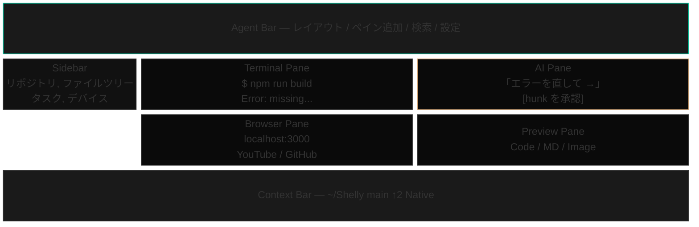
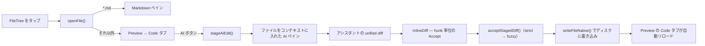
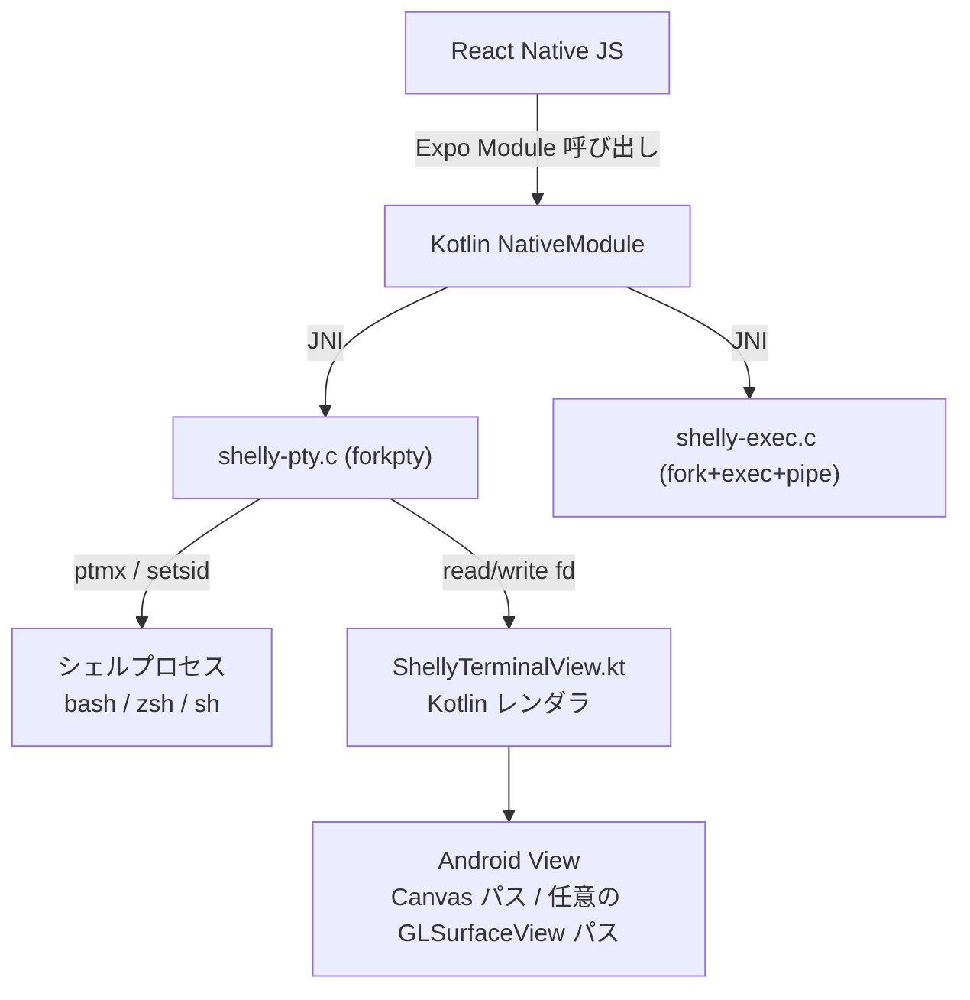
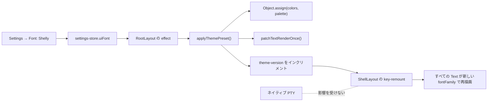

# アーキテクチャ詳細

[Shelly](../README.ja.md)のアーキテクチャの詳しい図解です。[READMEのアーキテクチャ節](../README.ja.md#アーキテクチャ)がシステム全体像とペイン間データフローをカバーし、このファイルは個々のサブシステムの内部実装です。

### 画面レイアウト

### AI Edit のゴールデンパス

各ステップは実在のモジュールです: `lib/open-file.ts`、`lib/ai-edit.ts`、`components/panes/InlineDiff.tsx`、`hooks/use-native-exec.ts`。

### ネイティブ PTY — JNI forkpty

用途の違う 2 つの JNI エントリポイントがあります。**`shelly-pty.c`** は対話シェルを担当し、`/dev/ptmx` を開き、`forkpty` 相当のロジック（`grantpt` + `unlockpt` + `setsid` + `/system/bin/linker64` 経由の `execve`）を実行して、マスター fd を Kotlin に返し、ターミナルビューがそれを読みます。**`shelly-exec.c`** はプログラム的な一発実行（`git status`、`ls`、ファイル I/O、AI ディスパッチのヘルパー）を担当し、素直な `fork` + `exec` + `pipe` を行って `{exitCode, stdout, stderr}` を同期的に返します。読み取りループは EAGAIN を認識して、select の空振りと本物の EOF を区別します（bug #70 の修正）。

TCP なし。ソケットのターミナルサーバーなし。別立ての PTY ヘルパーデーモンなし。シェルは普通に fork された子プロセスとして動き、PTY のマスター fd はアプリが所有して、Kotlin から JNI 経由で直接読みます。

### 実行中のテーマ切り替え

`colors` オブジェクトはミュータブルで同一性を保つので、`import { colors as C }` しているすべての箇所がコードの変更なしに新しい値を見ます。フォントの変更は Text のモンキーパッチが担当します。theme-version の key-remount が、描画されるすべての Text をそのパッチに通します。PTY は JS の外にいるので、影響を受けません。
