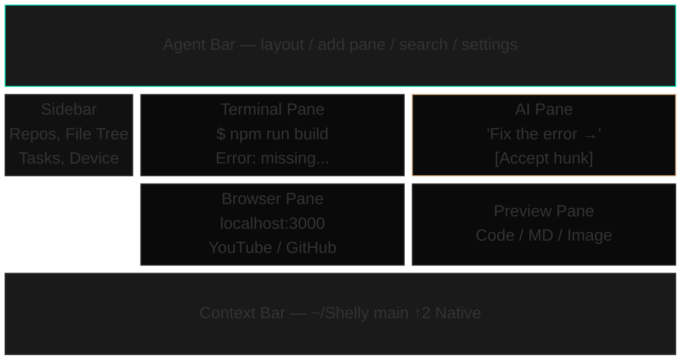
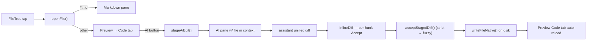
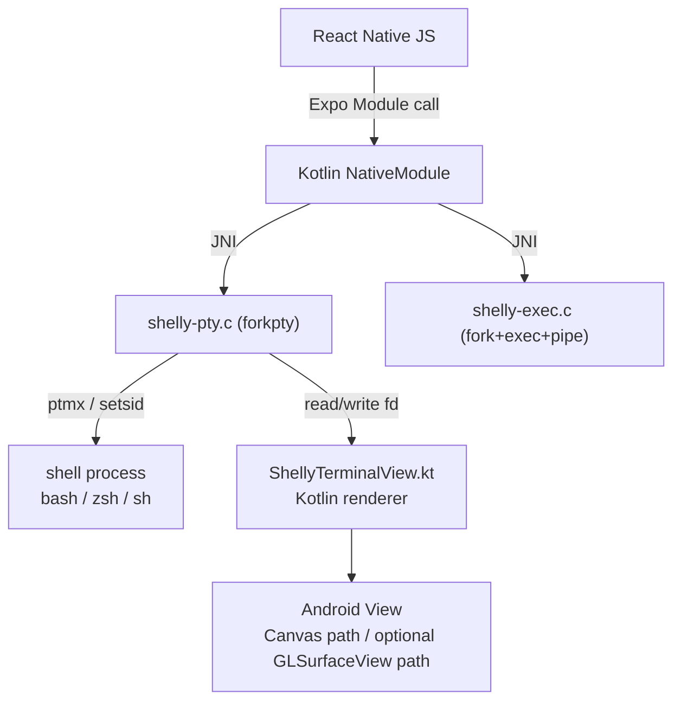
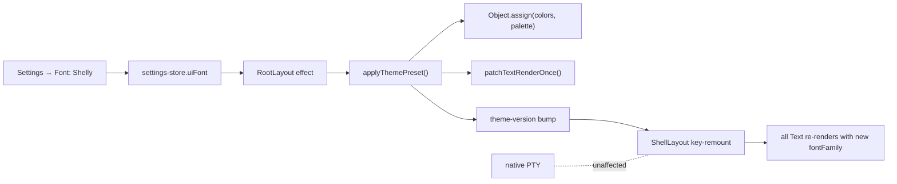

# Architecture Detail

Deeper diagrams for [Shelly](../README.md)'s architecture. The [README's Architecture section](../README.md#architecture) covers the system-level picture and the cross-pane data flow; this file has the internals underneath specific subsystems.

### Screen Layout

### AI Edit Golden Path

Each step is a real module: `lib/open-file.ts`, `lib/ai-edit.ts`, `components/panes/InlineDiff.tsx`, `hooks/use-native-exec.ts`.

### Native PTY — JNI forkpty

Two JNI entry points for two different needs. **`shelly-pty.c`** owns interactive shells: it opens `/dev/ptmx`, calls `forkpty`-equivalent logic (`grantpt` + `unlockpt` + `setsid` + `execve` via `/system/bin/linker64`), and hands the master fd back to Kotlin for the terminal view to read. **`shelly-exec.c`** owns programmatic one-shots (`git status`, `ls`, file I/O, AI dispatch helpers): it does a vanilla `fork` + `exec` + `pipe` and returns `{exitCode, stdout, stderr}` synchronously, with an EAGAIN-aware read loop that distinguishes spurious select wakes from genuine EOF (bug #70 fix).

No TCP. No socket terminal server. No separate PTY helper daemon. Shells still run as normal forked child processes, while the PTY master fd is owned by the app and read directly from Kotlin via JNI.

### Runtime Theme Swap

The `colors` object is mutable and keeps the same identity, so every `import { colors as C }` consumer sees the new values without a code change. The Text monkey-patch handles font changes. The theme-version key-remount forces all rendered Text through the patch. PTY lives outside JS, so it's untouched.
